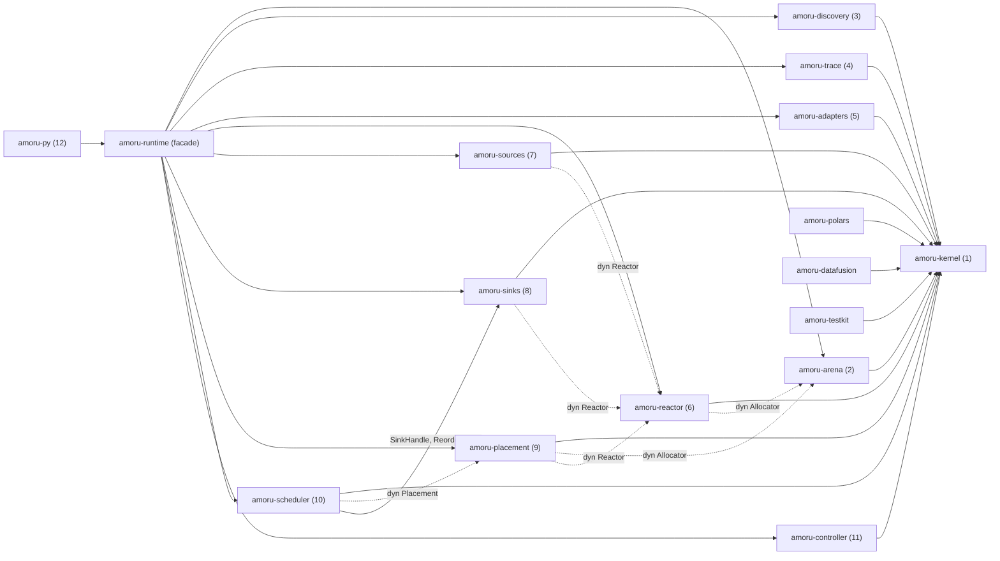
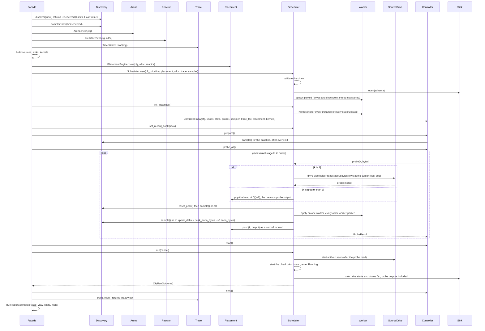
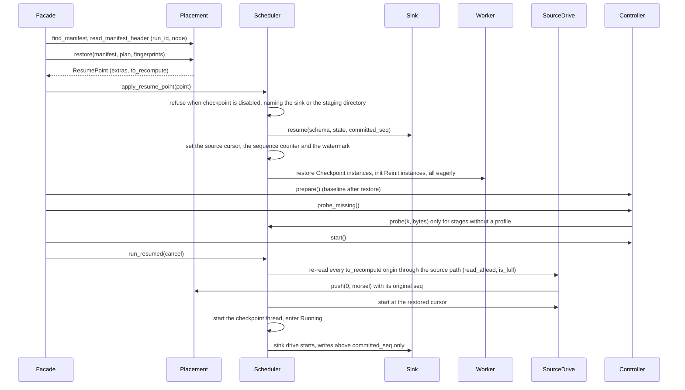

# Amoru SDD: Preamble

**Document type:** software design document, shared preamble (read by every agent before its component SDD)
**Status:** DRAFT · 2026-09-22 (revised 2026-09-15 draft: component graph, run lifecycle, lock order, waves, escalation routing, hand-off)
**Parent:** `architecture/amoru-runtime-design.md` (revision 3), the architecture design; this preamble does not repeat its context or its alternatives, it decides what the architecture left open and fixes what every component shares.
**Language and repository:** Rust 2024 edition for the runtime, Python 3.13 and 3.14 for the surface, one Cargo workspace at the repository root.
**Reference hardware:** the Griot bare-metal server in Nairobi (decided 2026-09-22, closing E1). It is where benchmark figures are recorded so that they are comparable between runs; it is not a target the runtime is built for. Every criterion is a ratio measured on whatever host the run is on (S3 against a baseline grid-searched on that host, S4 against that host's discovered quota and device ceiling, S12 against a plain loop on that host, S15 against the same run's own pre-spill throughput), so a different or larger machine moves both sides of every ratio and needs no change to the code, the defaults or the profiles. No GPU host is named: tests needing a device or GPUDirect Storage are skipped and listed by id.

This preamble plus the contracts SDD (`01-contracts.md`) plus one component SDD is the complete brief for an agent building that component. Nothing else in the repository is required reading; the only other text an agent may read is a section of another SDD that its own SDD cites by id (section 9).

---

## 1. Purpose, boundary and component map

### 1.1 What the runtime is

Amoru runs a full pass over a dataset larger than the memory budget of the process it lives in, applying a transformation a query engine cannot express, and writes the result out, at close to the budget's capacity, without the user choosing a batch size, a worker count, a read-ahead depth or a spill threshold. The dataset is tabular (Parquet, delivered as Arrow record batches) or tensor (safetensors, NumPy, aligned binary, delivered as DLPack tensors). The budget is discovered from the host (a cgroup, the machine) or given explicitly. The unit of everything is a morsel: one Arrow batch or one tensor with a header, moved between memory tiers by DMA, never copied by the CPU after it has been decoded once.

### 1.2 What the runtime refuses to be

Not a distributed engine: one process, one host. Not a query planner: kernels are opaque and there is no optimiser. Not a streaming system: no per-record latency guarantee. Not a storage system: sources read from whatever store exists. Not a model server: weight-major execution is a later document (parent D11).

### 1.3 Components and the edges between them

Twelve components. The number is also the build order and the SDD file number. An edge "A → B" means A calls B through an interface in the contracts crate; the contract on the edge is the one sentence that the calling side may rely on.

| # | Component | SDD file | Consumes | Contract on each consumed edge |
|---|---|---|---|---|
| 1 | Contracts crate | `01-contracts.md` | nothing internal | (defines every interface below) |
| 2 | Memory arena | `02-arena.md` | 1 | implements `Allocator`; every buffer it returns is 64-byte aligned, page-aligned when larger than a page, and lives in the tier requested or the call fails |
| 3 | Resource discovery and host profile | `03-discovery.md` | 1 | produces `Limits` and `HostProfile`; values are read from the host at call time, never cached across calls |
| 4 | Trace writer and run report | `04-trace.md` | 1 | accepts `TraceRecord` from any thread without blocking the caller for longer than a bounded channel push; flushes on `finish` and on abort |
| 5 | Kernel adapters | `05-adapters.md` | 1 | each adapter is a `Kernel`; the Python adapter never copies payload bytes across the interpreter boundary |
| 6 | IO reactor | `06-reactor.md` | 1 (2's arena arrives as `dyn Allocator`; 3's `HostProfile` arrives as a contracts value) | implements `Reactor`; every operation completes exactly once, into the buffer it was given, on the reactor's threads, never on a worker; submission never blocks the caller |
| 7 | Sources | `07-sources.md` | 1, 2, 6 | implement `Source`; `plan` is complete before the first `read`; `read` returns a payload in the tier the allocator was asked for |
| 8 | Sinks | `08-sinks.md` | 1, 2, 6 | implement `Sink`; `write(seq, payload)` takes ownership of the payload; `finish` is called exactly once after the last `write` completes; `committed_seq` never overstates |
| 9 | Placement engine | `09-placement.md` | 1 (2's arena arrives as `dyn Allocator`, 3's values as contracts types, 6's reactor as `dyn Reactor`) | implements `Placement`; `pop` returns a morsel already resident in the tier the caller asked for, or blocks; `push` never blocks; `checkpoint` writes a manifest from which `restore` rebuilds the queues |
| 10 | Scheduler | `10-scheduler.md` | 1, 8 (`SinkHandle`, `ReorderBuffer`), 9 | implements `Knobs`, `StatsSource` and `Prober`; workers only ever run `Kernel::apply` and nothing that blocks on IO |
| 11 | Resource controller | `11-controller.md` | 3, 4, 9, 10 (all four through contracts traits; the crate depends on `amoru-kernel` alone) | the only writer of every knob; reads stats, never morsels |
| 12 | Python surface | `12-python.md` | all | the only component that knows what a user is |

The agent building component N is handed this preamble, `01-contracts.md`, and `0N-<name>.md`, and the fakes for every interface N consumes (section 6.4).

The crate graph below is drawn from each SDD's section d.2: a solid edge is a concrete crate dependency in `Cargo.toml`, a dashed edge is a dependency on a trait object (`dyn`) whose concrete type the facade supplies, so the consuming crate compiles against `amoru-kernel` and is tested against a fake.



This diagram answers "which components can be built in parallel and which concrete type a fake stands in for": every crate whose only solid edge points at `amoru-kernel` can be built as soon as wave 0 lands, and every dashed edge names the fake (contracts d.15) that stands in for the concrete crate until the facade wires the real one.

### 1.4 Per-component schema

Every component SDD has these fifteen sections, in this order, with the component's two-letter prefix (CT, AR, DS, TR, AD, RE, SO, SI, PL, SC, RC, PY) on every invariant and test id:

a. Purpose and boundary. b. Vocabulary specific to the component. c. Invariants, `XX-I1..`. d. Interfaces: exposed and consumed, complete signatures. e. Data model, formats and state machines. f. Algorithms and policies. g. Concurrency within the component. h. Behaviour: normal path, edge cases, failures. i. Configuration: this component's rows of the global table. j. Observability. k. Tests, `XX-T1..`. l. Implementation notes for the agent. m. Open items: only items that block the build; each is either resolved or moved to the escalation list (section 7) before hand-off, so this section is empty in a hand-off-ready document. n. Traceability: parent ids to invariants to tests. o. Deferred (post-v1): items the component knows about and will not build in v1, with ids `XX-O1..` (an item that started life in section m keeps its number when it moves, so `XX-M1` becomes `XX-O1`); nothing in this section blocks hand-off, and an agent that finds it needs one of these items to meet a gate stops and reports.

Every SDD carries a status line of the form `**Status:** DRAFT · <date> (becomes HANDOFF-READY when section m is empty and the preamble's E1 and E2 assumptions are accepted)`. The status is flipped to HANDOFF-READY by the human, not by the PM and not by an agent, once section m is empty and E1 and E2 have been answered or their assumptions explicitly accepted for that component. Test ids and invariant ids are stable: a new one is added at the end of its sequence, never inserted, and an id is never reused.

The test for every sentence in a component SDD: could two competent implementers build two different things from it? If yes, it is not finished.

---

## 2. Global vocabulary

Terms used by more than one component are defined here once. A component SDD adds terms only it uses. Units are bytes unless stated.

**Morsel.** One unit of work: a payload plus a header (sequence number, stage, byte size, origin, features). The scheduler hands out morsels, the placement engine moves them, queues hold them, the trace records them.

**Payload.** The data inside a morsel: either an Arrow `RecordBatch` (a table) or a DLPack-backed tensor, each tagged with the tier where its bytes currently are.

**Staging codec.** How a segment record's bytes are encoded on disk: `Raw` (the in-memory layout, DMA both ways) in v1; a compressed variant is reserved (contracts d.2, architecture 5.6).

**Tier.** Where bytes physically live: `Device(id)` (accelerator memory), `PinnedHost` (page-locked host RAM, valid DMA source and target), `Host` (ordinary host RAM), `Disk(segment)` (a staging segment on local storage; no resident bytes), and the reserved `Remote(node, ref)` (registered memory on another node of the same run; never produced in v1, always matched explicitly, CT-I11).

**Stage.** One position in the linear chain source → kernel₁ → … → kernelₙ → sink. Stage 0 is the source's output; stage k is kernel k's output; the sink consumes the last stage.

**Queue.** The ordered set of morsels between two adjacent stages, owned by the placement engine. Q0 is between the source and kernel 1.

**Budget.** The bytes the runtime may hold in a tier. The host budget is derived from the discovered or explicit limit minus baseline and reserve; the device budget likewise per device; the disk budget is the staging limit.

**Baseline.** Anonymous host memory of the process after all kernels' `init` have completed and before the first morsel is read.

**Reserve.** The fraction of the ceiling deliberately never allocated, so a misestimate lands in headroom rather than in the OOM killer.

**Amplification (`A_k`).** For kernel k, the ratio of peak working-set bytes during `apply` to input payload bytes, measured by the probe and refined per morsel.

**Probe.** The first morsel of each kernel stage, run alone at a fixed small size to measure `A_k` before the controller sizes real morsels. The scheduler builds it (contracts `Prober`): for stage 1 by one synchronous read at the source cursor, for a later stage by popping the previous stage's probe output; its output continues downstream as a normal morsel.

**Probed.** The state of a host guarantee that the platform did not declare and discovery measured instead: `Guarantee::Probed(true)` means the path is available and may fall back on failure; `Guarantee::Present` means declared, and a failure on it is a platform bug (contracts d.12, G-I7).

**Checkpoint thread.** The scheduler's thread that writes the run manifest every `checkpoint.interval_ms` while the run is `Running` or `Draining`; it does not exist while the run is being prepared, and the scheduler writes the final manifest itself on termination and cancellation (section 4.1).

**Engine baseline.** The benchmark figure obtained by running the same kernel as a user-defined function inside Polars and inside DuckDB over the same files in the same container (section 6.5); reported beside the hand-tuned baseline, never a gate.

**Morsel target.** The controller's current intended payload size for a stage, in bytes; sources and the placement engine split or coalesce to approach it.

**Split.** A unit the source can read independently (a Parquet row group, a tensor or a slice of its leading dimension), with metadata known before reading.

**Look-ahead.** Using a split's metadata (row count, uncompressed bytes per column, shape) to size morsels before the bytes are read.

**Promotion / demotion.** Moving a morsel's bytes up toward the tier its consumer wants / down toward disk, by DMA. Promotion is toward the head of a queue; demotion is from the tail.

**Head stays hot.** The invariant that the next morsel a consumer will pop is never the one being demoted.

**Staging segment.** A file on local disk holding one or more demoted morsels in their in-memory layout (Arrow IPC or Amoru aligned binary), page-aligned, written with direct IO.

**Direct IO.** Reads and writes that bypass the page cache (`O_DIRECT`), so bytes move between disk and a runtime buffer without an intermediate kernel copy; requires aligned buffers, offsets and lengths.

**Host profile.** The set of guarantees a platform declares about the host (huge pages present, memlock permitted, io_uring allowed, GPUDirect Storage present, NVMe staging path), which lets the runtime skip probing and treat a failure on a guaranteed path as a platform bug.

**Knob.** One of the controller's outputs: morsel target per stage, active worker count, read-ahead depth, staging trigger per queue, high-water mark per queue and tier.

**Trace record.** One row per morsel completion, in the schema fixed in the contracts SDD; the run report is computed from the trace alone.

**Fingerprint.** A stable identity for a kernel (code identity plus configuration hash) used to key profiles across runs.

**Fake.** A test implementation of a contracts-crate interface with deterministic, configurable behaviour, used by every component's tests in place of the real implementation of its dependencies.

---

## 3. Global invariants

These hold across components. Each component SDD cites the ones it upholds and adds its own. Each is checkable; the test that checks it is named in the component SDD that owns the mechanism.

**G-I1. The budget is never exceeded.** At every sample, anonymous host memory of the process is at or below the host ceiling, and device memory allocated by the runtime is at or below the device budget. Owner: arena (allocation), controller (sizing), placement (demotion). Parent S1.

**G-I2. No CPU in the data path after decode.** Once a payload exists in a tier, every subsequent movement of its bytes is a DMA operation issued by the reactor or a pointer hand-off; no component copies payload bytes with the CPU except a source decoding from a non-layout-preserving format (Parquet) and a sink encoding to one. Owner: reactor, placement, adapters. Parent D10, S13, S14.

**G-I3. The head of every queue is resident.** When a consumer pops from a queue, the morsel it receives is already in the tier the consumer declared; the consumer never waits on a disk read that could have been started earlier, and a wait that does happen is traced as a placement miss. Owner: placement. Parent D10.

**G-I4. Every morsel leaves exactly one trace record.** Every morsel that enters stage k produces one `TraceRecord` for stage k on completion, error or skip; none is dropped; the run report is a pure function of the trace and the limits. Owner: scheduler (emission), trace (durability). Parent S9.

**G-I5. Knobs have one writer.** Only the controller writes knobs; every other component reads them. Owner: controller, scheduler. Parent D2.

**G-I6. Two payload layouts and no more.** A payload is a `RecordBatch` or a DLPack tensor. No component introduces a third representation of morsel bytes, including in staging files. Owner: contracts. Parent D9.

**G-I7. Direct paths are performance, never correctness.** Every hardware-direct path (direct IO, io_uring, pinned memory, GPUDirect Storage, RDMA) has a fallback selected at start that produces byte-identical output, and the run report names the path taken. Owner: discovery (selection), reactor, arena, placement (fallbacks). Parent section 8 of the architecture document.

**G-I8. Failure is diagnosed, never signalled.** The runtime terminates a run itself, with a diagnostic naming the morsel, its features, its measured footprint and the budget, before the host can terminate it by signal; a run never ends in SIGKILL from the OOM killer under any kernel amplification. Owner: controller, placement, arena. Parent S6.

**G-I9. Parallelism does not depend on Python.** The scheduler, reactor, placement engine, arena and controller run at full parallelism on any Python build or with no Python present; the GIL affects only how many Python kernel invocations run concurrently. Owner: scheduler, adapters. Parent D4, S8.

**G-I10. Zero configuration beyond the budget.** A run started with defaults and no budget inside a cgroup, or with only a budget outside one, completes every benchmark in the suite. Owner: all. Parent S2, S5.

**G-I11. One framework at one node and at many.** Every type and signature the multi-node extension needs exists in the contracts now (`NodeId`, `Tier::Remote`, `Locality`, the run manifest), and every v1 `match` on them handles the general case explicitly rather than by a wildcard; adding the extension adds crates and feature-gated arms, never a signature change. Owner: contracts (CT-I11), placement, reactor, scheduler. Parent S16, D12; architecture section 11.

**G-I12. Recovery is by lineage, never by replication.** A run can be resumed from what the placement engine already put on disk plus re-reading the source for the rest; no component writes a byte for the sake of recovery, and the normal path pays only the manifest (a small file every few seconds). Owner: placement (manifest), scheduler (watermark, recompute), sinks (commit tracking), controller (profile persistence). Parent S17, D13, CT-I12.

---

## 4. Process and concurrency model

### 4.1 Threads

One process. Seven kinds of thread, fixed at start:

| Thread kind | Count | Created by | May touch | Must never |
|---|---|---|---|---|
| Main | 1 | the caller | builds the pipeline, calls `run`, blocks until completion | run a kernel; issue IO |
| Worker | N = discovered CPU ceiling (parked/active split managed by the scheduler) | scheduler | `Kernel::apply`, `Placement::pop` and `push`, `TraceRecord` emission, the arena | block on IO; write a knob; wait on a reactor completion |
| Reactor | R = `reactor.threads` (default 2, section 5) | reactor | file and object-store IO, DMA copy issuance and completion, staging segment IO | run a kernel; allocate outside the arena |
| Controller | 1 | controller | discovery sampling, placement and scheduler stats, knob writes, trace reads | touch payload bytes; block on IO |
| Trace writer | 1 | trace | drains the trace channel to the trace file | anything else |
| Drive | 2 (source drive, sink drive) | scheduler | `Source::read` and `Sink::write` submission, `Completion::wait`, `Placement::push`/`pop_blocking` on Q0 and Qn, `set_committed`; idle from `new`, driving from `run` | run a kernel; hold a placement lock across a wait |
| Checkpoint | 1, only when `checkpoint.enabled`; started when the run enters `Running`, stopped when it leaves `Running` or `Draining` | scheduler | every `checkpoint.interval_ms`: `KernelState::checkpoint` on stateful instances that declared it (acquiring each instance like a task), `Sink::checkpoint`, `Placement::checkpoint`, which writes the manifest with `std::fs` (write, fsync, rename) on this thread and not through the reactor; the scheduler writes the final manifest on termination and cancellation from its own thread by the same path | run `apply`; hold the stage table lock across the placement call; touch payload bytes; issue a reactor operation |

Kernels may use threads internally (a BLAS pool, Torch's intra-op pool) provided they are joined before `apply` returns; the scheduler cannot see them and the controller sizes for them only through observed CPU time.

### 4.2 Synchronisation and lock order

Locks are acquired in this order and never in reverse: (1) scheduler stage table and instance pools, (2) placement queue, (2b) placement lineage index, (3) placement moves map and tier accounting, (4) arena free lists, (5) trace channel, (6) controller state. A component that needs two of these takes the lower-numbered first and releases in reverse. No lock is held across a call into another component, without exception: the scheduler releases the stage table before it calls `Placement::pop`, `pop_blocking`, `push` or `peek_resident`, the placement engine releases its queue and lineage locks before it calls the reactor or the allocator (it collects the segment references it will release under the lineage lock, drops that lock, then locks the queues; placement f.11 and f.12), and a `Completion::then` callback, which runs on a reactor thread, takes placement locks only after the reactor has released its own. A component that finds it needs to hold a lock across a boundary call has found a contracts gap and reports it (E10).

Lock-free paths, with the argument for each in the owning SDD: worker task pickup (scheduler, atomic stage cursor), tier byte counters (placement, atomics), arena size-class pop (arena, per-class lock-free stack or a mutex per class; the arena SDD decides and records the benchmark that justified it).

Maximum blocking: a worker blocks only in `Placement::pop_blocking` waiting for a resident head, and in `Kernel::apply` for as long as the kernel takes. The reactor never blocks on a lock held by a worker. The controller's tick is bounded at 5 ms of held locks; if a sample takes longer, it is skipped and counted; test RC-T17 checks the bound.

### 4.3 Shutdown and cancellation

Three exits: completion (source exhausted, every queue drained, sink finished), termination by the runtime (diagnostic produced), cancellation (SIGINT or `KeyboardInterrupt` forwarded by the surface). All three follow the same sequence: the scheduler stops admitting source work; in-flight `apply` calls complete (bounded by the longest kernel); the placement engine cancels in-flight moves and releases tier accounting; the sink's `finish` runs on completion only, otherwise its completed files remain and uncommitted buffers are dropped; the trace channel drains and the writer flushes; the arena is released; the report is produced with the exit reason. Every component's SDD names what it does at each step. `Scheduler::run` and `run_resumed` return `Ok(RunOutcome)` for every run that entered `Running` and `Err` only for a failure before that; the facade maps a `Terminated` outcome to an error with the partial report attached. `Scheduler::shutdown` (also called from `Drop`) sets the cancel flag, unparks and joins the workers, aborts the drives and stops the checkpoint thread; the scheduler calls `TraceSink::flush`, and the facade calls the trace writer's `finish` exactly once.

### 4.4 Run lifecycle

The order in which the facade builds and starts the components is fixed, because the baseline sample, the probes and the instance pool depend on it. A fresh run: discover, arena, reactor, trace, sources and sinks built, kernels built, placement, `Scheduler::new` (validates the chain, opens the sink, spawns the workers parked; the drives and the checkpoint thread are not started), `scheduler.init_instances()` (runs `Kernel::init` eagerly for every instance up to `max_instances` of every stateful stage, on the worker that will own it; a stateless stage has no instances), controller `prepare` (the baseline is sampled here, after every `init`), controller `probe_all` (through `Prober`), controller `start`, `scheduler.run` (starts the drives and the checkpoint thread, enters `Running`), controller `stop`, trace `finish` by the facade, report. There is no lazy instance creation: the pool is full before the first probe.



This diagram answers "who builds the probe morsel and when are instances created relative to the baseline sample": the scheduler builds the probe morsel through a drive-side helper for stage 1 and by popping the previous queue's head afterwards, and every instance exists before the controller samples the baseline.

A resumed run replaces `open` with `resume`, restores the instance pool and re-reads what the manifest could not point to on disk, before any probe. The facade reads the manifest header first (for `run_id` and `node`, which go into `PlacementConfig`), then `Placement::restore`, then `Scheduler::apply_resume_point(point)` (refuses at once when `checkpoint.enabled` is false, naming the sink when the reason is a non-resumable sink, contracts d.8, and the staging directory otherwise; then `Sink::resume` instead of `open`, the cursor and sequence counter set, `Checkpoint` instances restored, `Reinit` instances re-inited eagerly, the watermark set), then controller `prepare`, `probe_missing` (only stages without a profile), `start`, then `scheduler.run_resumed(cancel)`, which re-reads `to_recompute` through the source path (obeying `read_ahead` and `is_full`) and then continues as `run`.



This diagram answers "when is the sink resumed relative to the probes and the recompute reads": the sink is resumed inside `apply_resume_point`, before any probe runs and before any recompute read is issued, so a probe output or a recomputed morsel reaching the last queue always finds a sink that knows its watermark.

---

## 5. Global configuration table

Every tunable in every component. Owner is who may set it at runtime: `user` (Python surface), `controller` (knob), `platform` (host profile or environment variable), `compile` (feature flag or constant). A value outside its range is clamped to the nearest bound and the clamp is reported. Clamping has one owner per row: the scheduler clamps every scheduler-side knob (`morsel_target`, `workers.active`, `readahead.splits`, `queue.high_water`, `queue.promotion_window`, the staging trigger) and counts each clamp in `SchedulerStats::knob_clamps` (contracts d.11); discovery clamps `budget.host` and `budget.device`; the facade clamps everything else once, at argument translation, and reports each clamp in the run report's `notes`. Test PY-T13 walks the whole table with one out-of-range value per row and checks the owner and the report. Component SDDs copy their rows into section i and may not add rows without adding them here.

| Name | Component | Type | Default | Range | Owner | Effect |
|---|---|---|---|---|---|---|
| `budget.host` | 3, 11 | bytes | discovered: `memory.high`, else 0.9 × `memory.max`, else 0.9 × total RAM | 256 MiB .. host | user, platform (`AMORU_BUDGET`) | host ceiling |
| `budget.reserve_fraction` | 11 | f32 | 0.10 | 0.02 .. 0.30 | platform | headroom never allocated |
| `budget.device` | 3, 11 | bytes per device | discovered free device memory × 0.9 | 64 MiB .. device | user | device ceiling |
| `budget.disk` | 9 | bytes | 20% of free space in staging dir, or pod ephemeral limit | 0 .. free | user, platform (`AMORU_SPILL_LIMIT`) | staging cap; 0 disables the disk tier |
| `staging.dir` | 9 | path | platform scratch (`/tmp`, pod ephemeral volume, `/local_disk0`) | existing writable dir | user, platform (`AMORU_SPILL_DIR`) | where segments go |
| `staging.segment_bytes` | 9 | bytes | 128 MiB | 64 MiB .. 256 MiB | compile | segment file size |
| `morsel.min_bytes` | 11 | bytes | 4 MiB | 1 MiB .. 64 MiB | compile | lower clamp on morsel target |
| `morsel.max_bytes` | 11 | bytes | 512 MiB | 64 MiB .. 2 GiB | compile | upper clamp on morsel target |
| `morsel.probe_bytes` | 11 | bytes | 16 MiB | 4 MiB .. 64 MiB | compile | probe morsel size |
| `morsel.alignment` | 1, 2 | bytes | 64 | fixed | compile | buffer alignment |
| `page.bytes` | 1, 2, 6 | bytes | 4096 (discovered when huge pages present) | fixed per host | discovery | direct IO alignment |
| `controller.target_fraction` | 11 | f32 | 0.85 | 0.60 .. 0.95 | compile | fraction of allowance the AIMD aims at |
| `controller.safety_initial` | 11 | f32 | 1.5 | 1.1 .. 3.0 | compile | initial multiplier on `A_k` |
| `controller.safety_floor` | 11 | f32 | 1.2 | 1.05 .. 1.5 | compile | lowest safety after convergence |
| `controller.increase_step` | 11 | f32 | 0.10 | 0.02 .. 0.25 | compile | additive increase per accepted adjustment |
| `controller.tick_ms` | 11 | ms | 250 | 50 .. 2000 | compile | periodic tick |
| `controller.damping_completions` | 11 | count | = active workers | 1 .. 64 | controller | min completions between adjustments |
| `controller.oscillation_flips` | 11 | count | 5 per 100 | fixed | compile | freeze trigger (S11) |
| `controller.freeze_morsels` | 11 | count | 100 | fixed | compile | freeze duration |
| `workers.max` | 3, 10 | count | discovered CPU quota (ceil) | 1 .. 1024 | platform | thread pool size |
| `workers.active` | 10 | count | = `workers.max` at start | 1 .. `workers.max` | controller | workers allowed to take tasks |
| `readahead.splits` | 7, 11 | count | 2 | 0 .. 64 | controller | source splits in flight |
| `queue.high_water` | 9 | bytes per queue per tier | set by controller from budget split | 0 .. tier budget | controller | admission threshold |
| `queue.low_water` | 9 | bytes per queue per tier | 0.5 × high | 0 .. high | controller | demotion stops here |
| `queue.promotion_window` | 9 | count | 2 | 1 .. 32 | controller | morsels promoted ahead of the head |
| `reactor.threads` | 6 | count | 2 | 1 .. 8 | platform | reactor thread count |
| `reactor.object_concurrency` | 6 | count | 8 | 1 .. 64 | controller (via readahead) | in-flight object-store requests |
| `reactor.file_depth` | 6 | count | 32 | 4 .. 256 | compile | in-flight file operations |
| `arena.huge_pages` | 2 | bool | discovered | fixed | discovery | back arena with huge pages |
| `arena.pin` | 2 | bool | true when a device is present and memlock allows | fixed | discovery | page-lock the arena |
| `trace.path` | 4 | path | none (in-memory only) | writable path | user | write the trace file |
| `trace.channel_capacity` | 4 | count | 4096 | 256 .. 65536 | compile | records buffered before the writer |
| `trace.memory_limit` | 4 | bytes | 64 MiB | 8 MiB .. 1 GiB | compile | in-memory trace chunks before overflow to disk |
| `errors.policy` | 10 | enum | `terminate` | `terminate`, `skip`, `budget(n)` | user | kernel error handling |
| `ordering.required` | 8, 10 | bool | false | fixed per sink | sink | reorder buffer on |
| `ordering.buffer_bytes` | 8 | bytes | 256 MiB | 16 MiB .. host budget/4 | compile | reorder buffer cap |
| `sink.concurrency` | 8, 10 | count | 2 | 1 .. 8 | compile | sink writes in flight |
| `sink.row_group_bytes` | 8 | bytes | 128 MiB | 16 MiB .. 1 GiB | user | Parquet row group target |
| `sink.file_bytes` | 8 | bytes | 1 GiB | 64 MiB .. 16 GiB | user | output file roll size |
| `python.allow_gil` | 12 | bool | false | fixed | user | proceed serialised under a GIL |
| `profiles.dir` | 11 | path | `~/.amoru/profiles` | writable path or none | user, platform | profile store; place it on the durable volume with `staging.dir` for cross-node resume |
| `checkpoint.enabled` | 9, 10, 12 | bool | true when `staging.dir` resolves | fixed per run | user | write the run manifest periodically; forced false for a non-resumable sink |
| `checkpoint.interval_ms` | 9, 10 | ms | 5000 | 500 .. 60000 | user | manifest write cadence (also written at every segment roll, on termination and on cancel) |
| `checkpoint.keep` | 9, 12 | bool | false | fixed per run | user | keep the run directory and final manifest after a completed run |
| `resume` | 12 | string | none | run id, manifest path, `auto` | user | resume from a manifest instead of starting fresh |
| `durable_staging` | 3 | guarantee | `Unknown` (treated `Absent`) | `present`, `absent` | platform | declares `staging.dir` survives the node; part of `host_profile` |
| `sizer` | 11 | enum | `rule` | `rule`, `learned` | user | decision function |
| `sizer.fallback_error_ratio` | 11 | f32 | 2.0 | 1.2 .. 5.0 | compile | learned → rule fallback trigger |
| `host_profile` | 3 | struct | probed | declared via `AMORU_HOST_PROFILE` | platform | guarantees; see `03-discovery.md` |
| `AMORU_BENCH_MORSEL_BYTES` | 11, bench | bytes | unset | `morsel.min_bytes` .. `morsel.max_bytes` | bench only (environment variable read by the bench runner; not part of the API, not documented to users) | pins the morsel target for the S12 overhead measurement so the runtime and the plain loop process identical batches; S12 itself is measured with defaults (G-I10 unchanged), and the pinned figure is reported beside it |

---

## 6. Crate layout, dependencies, build order

### 6.1 Workspace

```
amoru/
  Cargo.toml                 workspace; members below; shared [workspace.dependencies] with pinned versions
  crates/
    amoru-kernel/            component 1: contracts. Depends on arrow, dlpark, thiserror, blake3 only.
    amoru-arena/             component 2
    amoru-discovery/         component 3
    amoru-trace/             component 4
    amoru-adapters/          component 5: the Python kernel adapter only (feature: python)
    amoru-reactor/           component 6
    amoru-sources/           component 7
    amoru-sinks/             component 8
    amoru-placement/         component 9
    amoru-scheduler/         component 10
    amoru-controller/        component 11
    amoru-runtime/           facade: the Rust side of component 12; wires 2..11 into `Runtime::run`; no logic of its own; built in wave 4
    amoru-py/                component 12: PyO3 module, built by maturin; depends on amoru-runtime; wave 5
    amoru-polars/            engine bridge: hosts a kernel inside Polars; depends on amoru-kernel and polars only (feature: polars)
    amoru-datafusion/        engine bridge: hosts a kernel inside DataFusion; depends on amoru-kernel and datafusion only (feature: datafusion)
    amoru-testkit/           fakes for every contracts interface, exactly the table in contracts d.15; depends on amoru-kernel only; wave 0
  python/amoru/              Python package source (thin; the module is amoru-py)
  bench/                     benchmark suite: data generator, kernels, runner, baselines (section 6.5); owned by the bench agent
  tools/lint/                repository lints run by CI: `no_tier_wildcard.sh` (CT-T14)
  tools/quality/             the quality gate: `check.sh` (fmt, clippy, the lint, tests, coverage) and `coverage_gate.py`; run by the pre-commit hook and by the first CI job (6.7)
  tools/hooks/               `pre-commit` (runs `tools/quality/check.sh`) and `install.sh` (sets `core.hooksPath`); every clone runs `install.sh` before its first commit
  architecture/              this documentation
```

Kernel authors depend on `amoru-kernel` alone. The Polars and DataFusion bridges are separate thin crates, as the architecture document's section 6 lays them out, and depend on `amoru-kernel` alone plus the host engine; `amoru-adapters` keeps only the Python adapter. The workspace root, every member crate as a compiling stub with its `Cargo.toml`, and `tools/lint` are wave 0 deliverables (section 6.6).

### 6.2 Dependencies

Pinned in `[workspace.dependencies]`; the agent building component 1 pins the latest stable of each at the time of writing and records the versions in a table at the end of this section (escalation E2 covers version bumps thereafter).

| Crate | Used by | Purpose | Notes |
|---|---|---|---|
| `arrow` (arrow-rs) | 1, 5, 7, 8, 9 | in-memory format, C Data Interface, IPC | features: `ffi`, `ipc` |
| `parquet` | 7, 8 | reader with footer metadata, projection, row selection; writer | features: `arrow`, `async`, `object_store` |
| `object_store` | 6, 7, 8 | S3-compatible, GCS, Azure, local | features per backend behind runtime features |
| `dlpark` | 1, 5 | DLPack `DLManagedTensor` safe wrapper | verify v1.0 versioned struct support |
| `safetensors` | 7, 8 | model and tensor files | header parsing only; bytes are mapped, not copied |
| `tokio` | 6, bench | reactor runtime | `rt-multi-thread`, `fs`, `sync` |
| `io-uring` | 6 | direct IO on Linux | optional feature `uring`; fallback is `pread`/`pwrite` on a blocking pool |
| `crossbeam` | 4, 9, 10 | bounded channels, deque | |
| `cudarc` | 2, 3, 6, 9 | CUDA driver: device memory, pinned host alloc, streams, copies | feature `cuda`; absent, `Tier::Device` is unconstructible |
| `pyo3` ≥ 0.28 | 5, 7, 12 | Python bindings | free-threaded default; version-specific wheels, no abi3 |
| `pyo3-arrow` | 5, 12 | Arrow ↔ pyarrow zero-copy | |
| `maturin` (build) | 12 | wheels | 3.13, 3.13t, 3.14, 3.14t |
| `thiserror` | all | error types | |
| `tracing` | all except 1 | log events (not the morsel trace) | `amoru-kernel` depends on `arrow`, `dlpark`, `thiserror` and `blake3` only (6.1, 01 section a) |
| `mimalloc` | runtime | global allocator for non-arena allocations | returns freed memory promptly |
| `blake3` | 1, 9, 11, bench | fingerprint, trace schema hash, profile keys | |
| `serde` | 4, 8, 9, 11 | derive for the manifest, sink checkpoint, profile records, run meta | features: `derive` |
| `serde_json` | 4, 8, 9, 11, 12 | the manifest (9 e.5), sink checkpoint (8 e.5), profile store, `PlacementConfig::config` | the only text format in the runtime |
| `base64` | 8, 9 | kernel and sink state bytes inside the JSON manifest and checkpoint | |
| `libc` | 2, 3, 6, 10 | `mmap`, `madvise`, `mlock`, `O_DIRECT`, `pread`/`pwrite`, cgroup and rlimit calls | |
| `bytes` | 6, 7, 8, bench | `object_store` payloads on the write path (a `Bytes` over an arena view, no copy) | |
| `getrandom` | runtime facade | minting `RunId` | |
| `hostname` | 9, bench | the node name in the manifest identity | |
| `polars` | `amoru-polars` | the Polars expression plugin host | feature `polars`; `pyo3-polars` deferred (12 o) |
| `datafusion` | `amoru-datafusion` | the DataFusion `ScalarUDF` host | feature `datafusion` |
| `tracing-subscriber` | 12, bench | log output for the Python surface and the bench runner | never in a library crate |

There is no `cufile` crate: the reactor's GDS path (feature `gds`) is a hand-written minimal FFI over `libcufile`, kept in the reactor and listed in its section l. Adding a crate this table lacks is an E2 item the PM may approve when the crate is named in the requesting SDD's d.2; a version bump of a pinned crate is the human's decision (section 7). The bench agent has no SDD, so section 6.5 is its d.2 for this purpose: the PM may approve a crate for `bench/` when it is needed by the work 6.5 describes and enters no shipping crate's graph (`bench` is not a dependency of any crate in 6.1), and the same table row records it as used by bench (decided by the PM 2026-09-22, after the F1.6 agent found the route closed and hand-rolled its argument parsing and its random number generator instead, which stand).

Pinned versions (filled by the component 1 agent in wave 0, F0.1, on 2026-09-22; the toolchain is `rust-toolchain.toml`, Rust 1.98.1 stable, edition 2024). Every entry is an exact `=` pin in the root `Cargo.toml`'s `[workspace.dependencies]` and, except `arrow`, `parquet` and `object_store` (see below), was the latest stable, non-yanked release on crates.io that day:

| Crate | Version | Crate | Version |
|---|---|---|---|
| `arrow` | 59.3.0 | `thiserror` | 2.0.20 |
| `parquet` | 59.3.0 | `tracing` | 0.1.44 |
| `object_store` | 0.13.2 | `mimalloc` | 0.1.52 |
| `dlpark` | 0.8.0 | `blake3` | 1.8.7 |
| `safetensors` | 0.8.0 | `serde` | 1.0.229 |
| `tokio` | 1.53.1 | `serde_json` | 1.0.151 |
| `io-uring` | 0.7.15 | `base64` | 0.23.1 |
| `crossbeam` | 0.8.5 | `libc` | 0.2.189 |
| `cudarc` | 0.19.9 | `bytes` | 1.12.1 |
| `pyo3` | 0.29.2 | `getrandom` | 0.4.3 |
| `pyo3-arrow` | 0.19.0 | `hostname` | 0.4.2 |
| `maturin` (build tool, not a Cargo dependency; pinned by the wave 5 `pyproject.toml` and the wheel job) | 1.15.0 | `polars` | 0.55.2 |
| `datafusion` | 55.1.0 | `tracing-subscriber` | 0.3.23 |

arrow and parquet are pinned to the 59 line because datafusion 55.1.0 and pyo3-arrow 0.19.0 require it; a single arrow version in the workspace is what S7 and S13 rely on (one RecordBatch type across amoru-kernel, the bridges and the Python surface); decided by the PM 2026-09-22 (E2). object_store is pinned to the 0.13 line for the same reason.

Supported targets, the set `deny.toml` resolves the graph for: x86_64 and aarch64 Linux (gnu) and x86_64 and aarch64 macOS. Windows is not a target for v1 (the runtime reads cgroup v2 and uses O_DIRECT and io_uring); a target added here is added to `deny.toml` in the same pull request. Decided by the PM 2026-09-22.

### 6.3 Feature flags

`cuda` (device tiers, pinned memory, copy engines), `uring` (io_uring path), `gds` (GPUDirect Storage; implies `cuda`), `rdma` (arena registration with the NIC, the reactor's `Remote` copy rows, the placement engine's remote tier; post-v1, see architecture section 11; its reserved arms exist in every v1 build and return `Unsupported("rdma")`), `python` (`amoru-adapters`, `amoru-sources` for `PyIteratorSource`, `amoru-py`), `polars` (`amoru-polars`), `datafusion` (`amoru-datafusion`). Default features: none of these. `amoru-py` enables `python` and, on Linux, `uring`. The two bridge crates are members of the workspace but are not dependencies of `amoru-runtime` or `amoru-py`; a user who wants them depends on them directly.

### 6.4 Test infrastructure (`amoru-testkit`)

Built by agent 1 in wave 0, in the same pull request as the contracts crate, and not extended thereafter without a `contracts/*` pull request. Its contents are exactly the table in contracts d.15: one fake per contracts trait, each with the knobs (builder methods) and observables that table lists, and nothing else. A test in any component SDD names a fake and a knob from that table only; a test that needs a knob the table lacks is a contracts change (E10), not a local addition. The benchmark data generator, the benchmark kernels and the host probes are not in the testkit; they belong to the `bench` agent (section 6.5).

### 6.5 Benchmark suite

The suite is owned by a named `bench` agent that starts in wave 1 and delivers in two parts. In wave 1 it delivers, under `bench/`, the data generator and the kernels: the generator writes Parquet with controllable row count, column mix (ints, floats, short strings, long text with configurable mean length and variance), null ratio and row-group size, to local disk and to an S3-compatible store (MinIO in a container), and writes safetensors and aligned binary tensors of controllable shape; the kernels are identity (Rust, A about 1), normalise (Rust, a hand-rolled one-pass normalisation over text, A about 1.5; the table in 6.2 has no regex crate and the bench agent hand-rolled the pass rather than add one, which the PM accepted on 2026-09-22 because a regex engine's prefilters and DFA cache sit between the measurement and the thing measured), tokenise-explode (Rust, A 5 to 10), adversarial (Rust, A jumps 4× at the midpoint), wide-intermediate (Python NumPy, A about 20, releases the GIL) and embed-score (numeric columns to tensor, small matmul, back to column; its amplification is `1 + out_dim / in_dim`, exact on an all-numeric table of 8-byte columns, declared by the bench agent and accepted by the PM on 2026-09-22 because 6.5 stated none); torch-score (stateful GPU model, weights via TensorSource) is added when the reference GPU host exists (E1). In wave 5 it delivers the baselines: for each kernel a hand-tuned baseline script (plain loop, fixed batch and threads, grid-searched) that reports rows per second, which is what S3 is measured against, and the *engine baseline*, which runs the same kernel as a user-defined function inside Polars (streaming engine) and inside DuckDB (Python UDF) over the same files in the same container, with each engine's defaults and then with its documented memory limit set to the budget; the engine baseline is reported beside the tuned baseline for every benchmark and is not a gate, because the claim it supports (that the runtime beats what people use today on this class of work) is an external one the report should carry rather than a criterion the build closes. Every gate runs in a container with `--memory` and `--cpus` set and on the bare host; results name the machine. This paragraph names the shapes, not the datasets: the generator's dataset names, its two scales, the `AMORU_S3_*` and `AWS_*` variables it reads and the manifest it writes are recorded in `bench/README.md`, which is the reference every later bench feature and every benchmark report cites (decided by the PM 2026-09-22 on the F1.6 agent's report; a change to that set is a change to that file, not to this section). The bench agent's brief is this paragraph plus sections 5 (the `AMORU_BENCH_MORSEL_BYTES` row) and 6.6; it reads no component SDD.

### 6.6 Build order and gates

Waves are the gate order: a wave's gate names the sufficiency criteria (parent S-ids) and global invariants it closes, measured by the tests the component SDDs name, and gates close in wave order because each cites the ones before it. Waves are not a limit on parallelism. An executor starts as soon as every crate its `Cargo.toml` depends on (a solid edge in the section 1.3 graph) is merged to `main` and the fakes its tests name exist; a component whose only solid edge points at `amoru-kernel` starts the moment wave 0 merges, whatever wave its gate is in. The "agents in parallel" column is the count that follows from those dependencies, not a cap, and the PM runs as many executors at once as the dependency graph and the build host allow (decided by Brackly, 2026-09-22). Work is serialised only where it cannot be parallelised: the testkit after the contracts crate, the scheduler after the sinks crate, the facade after every crate it wires, the Python package after the facade, and successive sessions of one component on its own branch.

| Wave | Components | Agents in parallel (from the dependency graph, not a cap) | Gate |
|---|---|---|---|
| 0 | 1 (contracts and `amoru-testkit`), the workspace skeleton, CI, `tools/lint`, the quality gate wired into CI | 1 | the workspace compiles with every member crate as a stub; `amoru-kernel` has no runtime dependency (`cargo tree`, CT-T12); every fake in contracts d.15 compiles against the traits and exercises every knob (CT-T13); CT tests pass; trace schema hash pinned (CT-T9); `tools/lint/no_tier_wildcard.sh` runs in CI (CT-T14); `tools/quality/check.sh` passes, so `amoru-kernel` and `amoru-testkit` each have at least 90% line coverage (6.7); the four CI jobs are green on the stubs |
| 1 | 2, 3, 4, 5, bench (generator and kernels) | up to 5 | AR, DS, TR, AD tests pass against fakes; G-I2 for the Python adapter (zero payload copies); S13 partial; the generator writes every dataset shape the suite names to local disk and MinIO |
| 2 | 6 | 1 | RE tests pass; direct IO and fallback both exercised on the developer host; G-I7 |
| 3 | 7, 8, 9 | 3 | SO, SI, PL tests pass; S10, S15 with `FakeSink` throttle; G-I3; manifest round trip and sink commit tracking (PL-T16, SI-T12, SI-T13) |
| 4 | 10, 11, `amoru-runtime` (the Rust facade) | 3 | end-to-end with fakes and with real components: S1, S2, S4, S5, S6, S11; G-I1, G-I4, G-I5, G-I8; kill-and-resume equivalence (SC-T16, PL-T17); the facade's lifecycle (section 4.4) driven by RC-T12 |
| 5 | 12 (the Python package), bench (tuned baselines and the engine baseline) | 2 | S3, S7, S8, S9, S12, S17 on the reference hardware; G-I9, G-I10, G-I12 (PY-T12); the whole configuration table clamped (PY-T13) |

Wave 0 deliverables, all by agent 1: the Cargo workspace root; every member crate of section 6.1 as a compiling stub with its `Cargo.toml` and the pinned versions of section 6.2; `crates/amoru-testkit` per contracts d.15; `.github/workflows/ci.yml` with four jobs (`cargo fmt`, `cargo clippy -- -D warnings` and `cargo test` on Linux; the container gate with `--memory` and `--cpus`; a MinIO job for the object-store paths; a Python matrix for 3.13, 3.13t, 3.14 and 3.14t); `tools/lint/no_tier_wildcard.sh`; the first CI job running `tools/quality/check.sh` (already in the repository, with `tools/hooks`), so that CI and the pre-commit hook apply one gate; and `git init` with `main` as the default branch if the repository is not yet initialised.

Environment per wave. Wave 0: stable Rust with the 2024 edition (the version is pinned in `rust-toolchain.toml` in this wave), `cargo`, docker for the container job, MinIO as a container, and the four Python interpreters only to prove the matrix job runs; no GPU. Wave 1: the same, plus the four Python interpreters with NumPy and pyarrow installed for component 5 and the bench kernels, and a cgroup v2 host (a container is enough) for component 3's tests. Wave 2: the same, plus a filesystem that accepts `O_DIRECT` (ext4 or xfs on a local disk, not tmpfs or overlay) and, where the host allows, io_uring; MinIO for the object-store paths; GDS and CUDA tests are tagged for the reference host (E1). Wave 3: as wave 2, plus enough local disk for the staging tests (10 GiB free) and MinIO. Wave 4: as wave 3, plus a container runtime that honours `--memory` and `--cpus`, so the kill-and-resume and budget tests run under a real ceiling. Wave 5: as wave 4, plus maturin and the four interpreters for the wheel matrix, Polars and DuckDB installed for the engine baseline, and the reference hardware named by E1 for the timing gates.

A wave gate is green when every test that is not tagged passes on the CI host, every test tagged "(reference host, E1)" has either passed on the reference host or is listed as skipped with its id in the wave's report, and every timing test that was run on another host is labelled provisional with that host's name. A component-level test that needs another real component or the reference host carries the tag "(integration, closes in wave N)" or "(reference host, E1)" in its SDD's section k and is excluded from the component pull request's gate; it closes in the wave its tag names. No wave starts until the previous wave's gate is green.

### 6.7 Conventions every agent follows

Base branch `main`. Branch names: `component/NN-<slug>` with the slug the crate suffix (`component/02-arena`, `component/10-scheduler`); `infra/<topic>` for the skeleton, CI and bench work; `contracts/<topic>` for a change to `01-contracts.md` and the contracts crate. One pull request per component, with one exception: a component may land in more than one pull request on its branch when merging a self-contained part of it early lets other executors start (the contracts crate before its testkit, for instance, because the arena, discovery and trace SDDs name no fake and need only the crate). Each earlier pull request is reviewed against the sections it implements; the review against the whole SDD, and the component's gate, happen on the last one (decided by the PM 2026-09-22, following Brackly's rule that work is serialised only where a dependency forces it). Agents commit as `Amoru Agent <agents@griotdata.com>` with `git commit -s`; the DCO sign-off on those commits is made on behalf of the project by its maintainer, and `CONTRIBUTING.md` states this. The PM merges a component pull request when its gate is green (section 6.6); a human merges every `contracts/*` pull request. `cargo fmt` and `cargo clippy -- -D warnings` clean; no `unwrap`/`expect` outside tests; every `unsafe` block has a `// SAFETY:` comment naming the invariant and lives in a module the SDD's section l permits (E9); tests named after the SDD ids (`ct_t3_payload_roundtrip`); benchmarks record the host in their output; no em dashes in documentation; the pull request template's sections are all filled (section 9). A test writes only to a scratch directory unique to its own process (the process id and a counter in the name, under the system temp directory or a `staging.dir` the test was given), never to a fixed path: several executors run the gate on one machine at the same time, and a fixed name made two runs delete each other's files, which fails as a wrong result rather than as a conflict (found and fixed 2026-09-22). Coverage: every crate that has code reaches at least 90% line coverage as `cargo llvm-cov` measures it with test code excluded (`AMORU_COVERAGE_MIN`, default 90, a compile-time constant of the gate, not a runtime tunable), judged per crate so a well-tested crate cannot carry an untested one; a compiling stub with no instrumented lines is not measured. The gate is one script, `tools/quality/check.sh` (em dashes, `cargo fmt`, `cargo clippy -- -D warnings`, `tools/lint/no_tier_wildcard.sh`, `cargo test`, coverage), run by the pre-commit hook and by the first CI job; every clone runs `tools/hooks/install.sh` before its first commit, and an agent never bypasses the hook (`--no-verify` and `AMORU_SKIP_QUALITY` are for a human committing documentation without a toolchain; CI runs the gate regardless). A test exists to prove an invariant or a section k test id, never to raise the number: coverage is the floor, the SDD's section k is the specification.

---

## 7. Escalation list

Decisions no component agent makes on its own. Each carries the assumption the agent takes until the item is decided, and names who decides it: "agent stops and reports" means the agent halts the affected work and files the item; "PM decides" means the PM agent answers it from these documents and records the answer; "human decides" means the PM files it as an issue with the design-change template and continues other work until the human answers. An agent reports an item using the design-change issue template (`.github/ISSUE_TEMPLATE/design-change.md`), naming the document, the section, what is wrong or missing and the invariants, criteria or tests affected.

| Id | Item | Assumption until decided | Who decides |
|---|---|---|---|
| E1 | Reference hardware | decided 2026-09-22: the Griot bare-metal server in Nairobi, named in every report it produces (the run report records the host, so no spec sheet is kept here). A test tagged "(reference host, E1)" run elsewhere is labelled provisional with that host's name. No GPU host exists: a test needing a device or GDS is skipped and listed with its id, never marked passed | decided |
| E2 | Dependencies after wave 0. Adding a crate the section 6.2 table lacks; bumping a pinned version | stay on the pinned versions; a crate named in the requesting SDD's d.2 may be added to the table by the PM in the same pull request; a version bump is an issue for the human | PM decides an addition named in a d.2; human decides a version bump |
| E3 | Ordering default. Parent Q2 | unordered; `ordering.required` is opt-in per sink | human decides |
| E4 | Error policy default. Parent Q3 | `terminate` | human decides |
| E5 | DAG support. Parent Q4 | linear chain only | agent stops and reports; human decides |
| E6 | Profile store sharing. Parent Q5 | per-user local directory | human decides |
| E7 | Databricks budget discovery. Parent Q6 | explicit budget required; discovery refuses to run on Databricks without one and reports `LimitSource::Explicit` | human decides |
| E8 | Weight-major execution. Parent Q7 | out of scope; no component may add a dependency that would preclude it (a payload that is not `Tier`-tagged, a queue that cannot hold source morsels on disk) | human decides |
| E9 | `unsafe` outside the permitted set. Each SDD's section l names the modules in which `unsafe` is permitted for that crate, with a `// SAFETY:` comment on every block; test code in any crate is exempt and may use `unsafe` to construct a state a test needs | not permitted outside the listed modules | agent stops and reports; PM decides whether the section l list is amended (a documentation change on the component branch) or the code is restructured |
| E10 | A new cross-component interface. Methods named in a component's own d.1 are pre-approved for that component; anything a consumer needs that is neither in `01-contracts.md` nor in the consumed component's d.1 is this item | not permitted in a component branch; it is a change to `01-contracts.md` and the contracts crate first, on a `contracts/<topic>` branch, in its own pull request | agent stops and reports; PM drafts the contracts change; human merges it |
| E11 | Implementing any reserved multi-node path: `Tier::Remote`, `Locality::Local`, the `rdma` rows of the placement move table and the reactor copy table, `NodeId` values other than `LOCAL_NODE`, and any peer, lease or queue-pair API | out of scope for every v1 component; the arms exist and return `Unsupported("rdma")`; the multi-node extension is its own set of SDDs later (architecture section 11) | agent stops and reports; human decides |
| E12 | Weakening a resume guarantee: any change that would make `committed_seq` overstate, a manifest reference a missing segment, a `Reinit` kernel's state be assumed safe, or the normal path write payload bytes for recovery | not permitted; G-I12 and the invariants PL-I11 to PL-I13, SI-I8 stand | agent stops and reports; human decides |
| E13 | Allocator interposition: replacing the allocator that a kernel author's libraries use (NumPy's `PyDataMem_SetHandler`, PyTorch's pluggable allocators) so that kernel-internal allocations count against the arena's budget instead of being observed by the sampler (adapters AD-O1; architecture section 8) | out of scope for v1; the guarantee for kernel-internal allocations is probe, sample, reserve and breach handling, with the cgroup as containment, and the architecture document says so | agent stops and reports; human decides |

An agent that hits an item in this table stops the affected work, files the report, and continues with any part of its component that the item does not touch. The PM answers the items in its column at once, files the human's items as issues, and does not block a wave on a human item unless the gate needs it.

---

## 8. Traceability

Filled as component SDDs land. The parent's S-ids and D-ids map to the invariants and tests that close them; a row with no entry is a gap.

| Parent id | Closed by (invariants) | Proved by (tests) |
|---|---|---|
| S1 | G-I1, AR-*, RC-*, PL-* | wave 4 end-to-end |
| S2 | G-I10 | wave 4, wave 5 |
| S3 | RC-* | bench suite, wave 5 |
| S4 | SC-*, RC-* | wave 4 |
| S5 | DS-* | DS tests in container |
| S6 | G-I8 | wave 4 adversarial |
| S7 | CT-*, AD-* | wave 1, wave 5 |
| S8 | G-I9, AD-* | wave 1 (GIL detection), wave 5 (speedup) |
| S9 | G-I4, TR-* | wave 1, wave 4 |
| S10 | PL-* | wave 3 |
| S11 | RC-* | wave 4 |
| S12 | wave 0 skeleton | wave 5 |
| S13 | G-I2, CT-*, AD-* | wave 1, wave 3 |
| S14 | G-I2, PL-*, RE-* | wave 3 (pinned path), Phase 9 (GDS) |
| S15 | PL-* | wave 3 |
| D1 | SC-* | wave 4 |
| D2 | G-I5, RC-* | wave 4 |
| D3 | SO-*, RC-* | wave 3, wave 4 |
| D4 | G-I9, AD-*, PY-* | wave 1, wave 5 |
| D5 | PL-* | wave 3 |
| D6 | SC-* | wave 4 |
| D7 | RC-* | wave 4 (learned sizer post-v1) |
| D8 | SC-* | wave 4 |
| D9 | G-I6, CT-* | wave 0 |
| D10 | G-I2, G-I3, PL-* | wave 3 |
| S16 | G-I11, CT-I11 | CT-T14 (lint, every wave), PL-T19 |
| S17 | G-I12, CT-I12, PL-I11 to PL-I13, SI-I8 | wave 3 (PL-T16, SI-T12, SI-T13), wave 4 (SC-T16, PL-T17), wave 5 (PY-T12) |
| D11 | E8 | (deferred) |
| D12 | G-I11, E11 | CT-T14 |
| D13 | G-I12 | wave 4 |

---

## 9. Hand-off protocol

**What an agent is given.** A component agent receives three documents, this preamble, `01-contracts.md` and its own component SDD, plus the `amoru-testkit` fakes for every interface its component consumes, and a brief from the PM built from `architecture/agents/executor.md` naming its component number, SDD path, wave and branch. Those three documents are its reading set. It may additionally read, read-only, any specific section of another SDD that its own SDD's text cites by id (for example "SC f.12" or "09 e.5"), and nothing else in that file; a need to read more than the cited section is a contracts gap and is reported (E10). The facade agent (`amoru-runtime`, the Rust side of component 12) reads every SDD, because it wires every concrete type; the PM reads everything. It works on branch `component/NN-<slug>` from `main` (section 6.7). Before writing code it copies the "environment facts to verify before starting" from its SDD's section l into its pull request, with the command and result for each.

**What an agent returns.** One pull request whose description follows `.github/PULL_REQUEST_TEMPLATE.md`: what it changes; the document and sections it traces to; the invariants and tests by id; "Environment facts verified" (each fact from section l with its command and result); "Tests skipped (id, reason)" (every test tagged "(integration, closes in wave N)" or "(reference host, E1)", and nothing untagged); "Provisional results (host)" (every timing figure obtained on a host other than the reference host, with the host name); and the checklist. It is done when every untagged test in its SDD's section k exists and passes, every invariant in section c is cited by at least one test, `cargo fmt` and `cargo clippy -- -D warnings` are clean, section m of its SDD is empty, the dependency table (section 6.2) lists every crate its `Cargo.toml` names, and every section of the template is filled. It stops and reports, rather than deciding, on anything in section 7, using the design-change issue template, and continues with the parts of its component the item does not touch.

**How the PM verifies.** The PM reviews the pull request against the SDD with the checklist in `architecture/agents/pm.md` (every invariant cited, every test present and passing or tagged, no wildcard tier arms, no `unwrap` outside tests, `// SAFETY:` on every `unsafe`, no em dashes in documentation, the dependency table updated, the template complete) and applies the gate rule of section 6.6: the component gate is green when every untagged test passes on the CI host and every tagged test is listed with its id and its closing wave or its host. The PM merges a green component pull request; a human merges every `contracts/*` pull request.

**How a contracts change is made mid-build.** A component agent that needs a change to `01-contracts.md` or the contracts crate stops the affected work and reports it (E10). The PM drafts the change on a `contracts/<topic>` branch: the contracts SDD, the crate, the testkit if a fake or knob changes, and every component SDD section the change touches, keeping every existing id stable. A human reviews and merges it to `main`. Every agent whose component consumes the changed interface then rebases its `component/*` branch on `main` before continuing; the PM tells each affected agent which sections changed. Nothing about a contract is changed on a component branch.

Precedence when documents disagree: the contracts crate, then the preamble, then the component SDD; a disagreement is reported through E10 and the lower document is corrected.
