# Amoru SDD 09: Placement engine (`amoru-placement`)

**Document type:** software design document, component 9 of 12, the load-bearing component
**Status:** DRAFT · 2026-09-15 (becomes HANDOFF-READY when section m is empty and the preamble's E1 and E2 assumptions are accepted; the human flips it)
**Parent:** `architecture/amoru-runtime-design.md` sections 5.6, 5.6a; decisions D5, D10, D11 (preconditions); criteria S10, S14, S15; global invariants G-I1, G-I2, G-I3
**Preamble:** `00-preamble.md`; **Contracts:** `01-contracts.md` d.10 (`Placement`, `TierBudgets`, `QueueStats`, `PlacementStats`, `CheckpointExtras`, `ResumePoint`), d.2 (`Tier`, `TierKind`, `SegmentRef`), d.3 (`Buffer`, `BufferView`, `Allocator`), d.9 (`Reactor`, `Completion::then`, `CopySrc`, `CopyDst`), e.1 (tier transitions), e.7 (`amoru_kernel::ipc`)
**Component location:** `crates/amoru-placement`, Rust; features `cuda`, `gds`
**Consumes:** contracts (1); the arena (2) as `Arc<dyn Allocator>` and the reactor (6) as `Arc<dyn Reactor>`, neither as a crate; discovery's (3) host profile as values in `PlacementConfig`. **Consumed by:** scheduler (10), controller (11), facade (12, `find_manifest` and `read_manifest_header`)

**Decisions worth your eye:** (1) a queue is a FIFO of entries with a per-entry state machine and the engine plans moves from queue position, not from time: promote the next `k` entries toward the consumer's tier, demote from the tail, and never both for one entry at once; (2) source morsels (Q0) may be demoted to disk as recomputable entries that are dropped rather than written when the disk tier is under pressure, and re-read from the source through the scheduler; (3) the staging log is append-only with fixed-size segment files numbered globally across queues, and a segment is deleted only when every entry in it has been promoted or consumed and the current run manifest no longer references it, which trades some disk for no compaction; (4) the engine writes the run manifest (e.5) because it is the one component that already knows where every uncommitted morsel is; (5) the engine has no thread: every move completes through `Completion::then` on the reactor thread that resolved it, and every reactor call is issued from the worker inside `push` or `pop`, which never blocks (RE-I6).

---

## a. Purpose and boundary

The placement engine owns every morsel between the moment a producer pushes it and the moment a consumer pops it. Its job is to have each morsel's bytes in the tier its consumer declared, before the consumer asks, using only DMA to move them, within per-tier budgets the controller sets. It keeps the head of every queue resident, demotes from the tail when a tier is over its high-water mark, uses local disk as a deliberate tier rather than an emergency, and reports every miss so the controller can widen the promotion window.

It owns: queue order; entry states; tier accounting and in-flight reservations; the move planner; the staging log (segment files, their format, their lifecycle); the disk budget; promotion and demotion policy; miss statistics; the run manifest (the record of every morsel not yet committed by the sink, where its bytes are if they are on disk, and where the source drive is) and the lineage index behind it; the resume path that rebuilds queues from a manifest.

It refuses to know: morsel contents; why a budget is what it is (controller); which worker will pop (scheduler); how a byte is moved (reactor); anything about kernels beyond their declared `PayloadSpec`; how to re-read a morsel from its origin (it lists what needs re-reading; the scheduler does it).

The engine is also the seam for the multi-node extension (architecture section 11): a `Tier::Remote` entry is an entry whose bytes are in another node's registered memory, and the move table has reserved rows for it. No v1 code path produces such an entry; every v1 path that could meet one returns `Unsupported("rdma")` (CT-I11).

## b. Vocabulary

**Entry.** One queued morsel with its placement state; identified by `(stage, seq)`.

**Consumer spec.** The `PayloadSpec` the queue's consumer declared through `set_consumer`; the target tier for promotion is derived from it: `Device(cfg.devices[0])` when `tier == Device` and a device exists (v1 uses the first device for every queue and collapses per-device budgets into the one `Device` slot; several devices are a v1 limit noted in the report), else the host tier.

**Host tier.** The run's one host tier (contracts e.1): `PinnedHost` when `alloc.is_pinned()`, else `Host`; read once at `new`. No entry is ever in the other one, and no move between them exists.

**Target tier.** The tier a promoted entry should reach; per queue.

**Promotion window (`k`).** The number of entries from the head, inclusive, that the engine keeps moving toward the target tier ahead of the consumer.

**High water / low water.** Per queue per tier, in bytes: above high, demotion starts; demotion stops at low. Set by the controller.

**Reservation.** Bytes claimed against a destination tier's budget for a move in flight, released when the move completes or fails.

**Recomputable.** An entry whose bytes can be re-obtained from its origin (CT-I12). `recomputable = (stage == 0)`: in v1 only Q0 entries are treated as recomputable (D5); the lineage index makes every entry recomputable in principle, and `DemotionPolicy` below reserves the choice.

**Demotion policy.** `Write` (demote by writing a segment record) or `Evict` (demote by dropping the bytes and listing the entry for recomputation from its origin through stages 1..k; reserved for queues other than Q0, to be selected by a later controller when the cost of re-running the chain up to stage k is below the cost of writing and reading the bytes). The enum exists so that the entry state machine and `evicted()` are written once for any stage, not for stage zero; it is not a configuration field. What decides at run time is the queue's `staging_enabled` flag alone (`set_staging(stage, on)`): with it off and the entry recomputable, demotion evicts; with it on, demotion writes; with it off and the entry not recomputable, no demotion is possible (PL-I6, f.2). The default is off for Q0 and on for every other queue, which is `Evict` for Q0 and `Write` elsewhere.

**Segment.** A staging file, `staging.segment_bytes` in size, append-only, holding whole payload records; numbered by one counter per engine across all queues (`seg-<n:06>.seg`); one active segment per queue at a time, so records of one queue are contiguous within a segment and a segment holds records of one stage (the record header carries the stage regardless).

**Record.** One payload written into a segment: a record header in its own page, followed by the payload's pieces, each at a page-aligned offset (e.3).

**Lineage index.** A map from `seq` to `(origin, stage, disk copy if any)` for every morsel the engine has seen that the sink has not yet committed. It is what the manifest is written from and it is small: one 64-byte record per uncommitted morsel.

**Committed watermark.** The highest `seq` such that every morsel at or below it is committed by the sink, as told to the engine through `set_committed`. Lineage below the watermark is dropped.

**Manifest.** The file the engine writes at `checkpoint` and reads at `restore`: the lineage index, the source cursor, the sink and kernel checkpoints the scheduler hands over, and enough identity (run id, plan digest, kernel fingerprints) to refuse a resume against a different run.

## c. Invariants

**PL-I1. Head stays hot.** If the head entry of a queue is not resident in a tier satisfying the consumer spec, a move toward the target tier is in flight for it, and no demotion is in flight for it. Upholds G-I3.

**PL-I2. An entry has at most one move in flight.** Promotion and demotion of the same entry never overlap; a demotion request for an entry with a promotion in flight is dropped (the promotion wins because position beat pressure).

**PL-I3. Tier accounting is exact and includes reservations.** For every tier, `resident_bytes + reserved_bytes ≤ budget` at all times; a move is issued only after its destination reservation succeeds. Upholds G-I1.

**PL-I4. Bytes move only by the reactor.** The engine issues `Reactor::copy` for every tier change; it never reads or writes payload bytes itself. Upholds G-I2, S14.

**PL-I5. FIFO order is never violated.** `pop` returns entries in push order per queue; demotion changes where an entry's bytes are, never its position.

**PL-I6. Q0 never writes source morsels to disk unless told to.** With `set_staging(0, false)` (the default), Q0 demotion drops recomputable entries (`Evicted`) rather than writing; with `true` (weight-major and deep read-ahead, E8), Q0 writes like any other queue. Upholds D5.

**PL-I7. Disk is bounded.** Staging bytes across all queues never exceed `budget.disk`. Disk is charged per segment: opening a segment charges `segment_bytes` against `disk_bytes` (`disk_bytes + segment_bytes ≤ disk_budget`, else no segment opens), and unlinking one releases it; a record never charges separately, because the segment is preallocated at its full size. When a demotion needs a new segment and none can open, the engine evicts a recomputable entry or, for a non-recomputable one, fails the run with `AmoruError::Staging` carrying the totals, rather than growing. Upholds S10.

**PL-I8. A segment is deleted only when empty and unreferenced.** A segment file is unlinked only when every record in it is in state `Consumed` or has been promoted and its disk copy released, and the current manifest does not reference it (PL-I12); no live entry and no manifest on disk ever references a deleted segment.

**PL-I9. Misses are counted, never hidden.** Every `pop_blocking` that waits on a move increments `misses`, adds the wait to `miss_wait_us`, and returns the wait as the second element of its result (contracts d.10); the scheduler writes it into the trace as `placement_miss_wait_us`. There is no side channel.

**PL-I10. Close drains.** After `close(stage)`, pushes error, pops return the remaining entries in order then `None`; no entry is lost.

**PL-I11. Lineage is kept until commit.** Every morsel that has been pushed to any queue and not yet covered by the committed watermark has a lineage record (origin, current stage, disk copy if any), including morsels that have been popped and are inside a kernel or the sink. Upholds CT-I12. Rationale: the manifest must be able to name every morsel whose output the sink does not yet have, or resume produces gaps.

**PL-I12. The manifest is atomic and self-sufficient.** A manifest is written to a temporary name and renamed into place, so a reader sees either the previous manifest or the new one, never a partial one; and it references only segment files that exist at the moment of the rename (a segment is never unlinked while the current manifest references a record in it: unlink waits for the next manifest write). Rationale: a crash between two writes must leave a resumable state.

**PL-I13. Resume is by lineage, never by replication.** The engine never writes a morsel to disk for the sake of recovery; the manifest records what is on disk because pressure put it there, and lists the rest for recomputation. Upholds CT-I12, S17. Rationale: the normal path pays nothing for the ability to resume.

**PL-I14. The engine has no thread and never blocks a caller on IO.** Every reactor operation is issued from the thread that called `push`, `pop`, `replace`, a setter or `restore`, and returns at once (RE-I6); its outcome is observed through `Completion::then`, whose callback runs on the reactor thread that resolved it (contracts d.9). The engine never calls `Completion::wait`, never spawns a thread, and the only blocking call it offers is `pop_blocking`, which parks on a queue's unparker (CT-I7). Rationale: preamble 4.1; a placement thread would be a third party in every lock order.

**PL-I15. Segment files are touched only through the reactor, and a descriptor never outlives its file.** The engine writes and reads segment bytes through `write_file`, `read_file` and `copy`, names each segment to the reactor with `register_segment` before its first write, and calls `unregister_segment` before `unlink`, so the reactor's cached descriptor is closed and the space returns to the filesystem at unlink (RE-I8). The manifest is the one file the engine writes itself, with `std::fs` (f.12), because it is small and needs `fsync` and `rename` on the calling thread.

## d. Interfaces

### d.1 Exposed

```rust
pub struct PlacementConfig {
    pub run_id: RunId,                            // names the staging subdirectory and the manifest
    pub node: NodeId,                             // LOCAL_NODE in v1
    pub stages: u16,                              // number of queues = kernels + 1 (Q0 .. Qn)
    pub budgets: TierBudgets,                     // initial; controller updates
    pub staging_dir: Option<std::path::PathBuf>,  // None = no disk tier and no manifest
    pub durable_staging: bool,                    // profile.durable_staging.is_guaranteed(); recorded in the manifest
    pub disk_budget: u64,                         // budget.disk
    pub segment_bytes: u64,                       // staging.segment_bytes
    pub codec: StagingCodec,                      // Raw in v1 (contracts d.2); recorded in every segment record header
    pub page_bytes: usize,
    pub gds: bool,                                // profile.gds.is_available() && feature gds && reactor.paths().gds
    pub devices: Vec<DeviceId>,                   // devices[0] is the promotion target for Device consumers (b)
    // Manifest identity (e.5): what `checkpoint` writes and `restore` checks.
    pub plan_digest: [u8; 32],                    // BLAKE3 over the source plan (e.5); computed by the facade from `Source::plan`
    pub fingerprints: Vec<Fingerprint>,           // per stage 1..n, from `Kernel::fingerprint`
    pub resume_policy: Vec<ResumePolicy>,         // per stage 1..n, from `KernelHints::resume`
    pub config: serde_json::Value,                // the resolved configuration table (preamble section 5)
    pub checkpoint_enabled: bool,                 // checkpoint.enabled; false unlinks reclaimable segments at once (f.7)
}

pub struct PlacementEngine { /* private */ }
impl PlacementEngine {
    /// Reads `alloc.is_pinned()` once for the host tier; creates the run directory
    /// when `staging_dir` is `Some`; issues nothing to the reactor.
    pub fn new(cfg: PlacementConfig, alloc: Arc<dyn Allocator>, reactor: Arc<dyn Reactor>) -> Result<Arc<PlacementEngine>>;
    pub fn detailed_stats(&self) -> PlacementDetail;   // per-queue tier histograms, segments, evictions
    /// `staging_dir/amoru-<run_id>/manifest.json`, or None without a staging directory.
    pub fn manifest_path(&self) -> Option<std::path::PathBuf>;
    /// Locate the newest manifest (by `written_ns`) under `staging_dir` for `run_id`, or,
    /// with `None`, the newest manifest of any run in that directory (Python's `resume="auto"`).
    pub fn find_manifest(staging_dir: &std::path::Path, run_id: Option<RunId>) -> Result<Option<std::path::PathBuf>>;
    /// Read only the identity fields of a manifest (`run_id`, `node`, `hostname`, `version`)
    /// so the facade can build `PlacementConfig` with the manifest's run id before `restore`.
    pub fn read_manifest_header(path: &std::path::Path) -> Result<ManifestHeader>;
}
/// Contracts d.10, every method: `push`, `pop`, `pop_blocking`, `peek_resident`,
/// `evicted`, `replace`, `shutdown`, `set_committed`, `checkpoint`, `restore`, `is_full`,
/// `set_consumer`, `set_budgets`, `set_water`, `set_staging`, `set_promotion_window`,
/// `close`, `stats`. The scheduler and the controller hold `Arc<dyn Placement>`; only
/// the facade names the concrete type, for the two manifest helpers above.
impl Placement for PlacementEngine { /* contracts d.10 */ }

/// Reserved (b); no configuration field carries it in v1.
#[derive(Copy, Clone, Eq, PartialEq, Debug)]
pub enum DemotionPolicy { Write, Evict }

pub struct ManifestHeader { pub version: u32, pub run_id: RunId, pub node: NodeId, pub hostname: String, pub written_ns: u64 }
```

`set_water(stage, tier: TierKind, low, high)` keys a queue's marks by `TierKind` (contracts d.2); `Device` means the one device slot of b. `pop_blocking` returns `Some((morsel, wait_us))` (f.4). `find_manifest` orders candidates by the header's `written_ns`, not by file modification time.

### d.2 Consumed

`amoru_kernel::{Placement, Morsel, Payload, PayloadSpec, PayloadKind, TierPref, Tier, TierKind, TIER_COUNT, StagingCodec, SegmentRef, RemoteRef, DeviceId, NodeId, LOCAL_NODE, RunId, Locality, Origin, Split, Fingerprint, ResumePolicy, CheckpointExtras, SourceCursor, ResumePoint, TierBudgets, QueueStats, PlacementStats, Buffer, BufferView, ManagedTensor, Allocator, Reactor, Completion, CopySrc, CopyDst, AmoruError, ipc, amb1}` (`ipc::encode_framing` and `ipc::decode`, contracts e.7; `ManagedTensor::from_buffer`, d.4; `Buffer::into_arrow_buffer` and `BufferView::{of_arrow, of_tensor}`, d.3; `copy`, `write_file`, `read_file`, `read_file_opt`, `register_segment`, `unregister_segment`, `paths` of d.9); `crossbeam` (`Parker`/`Unparker` for `pop_blocking`); `serde_json` (the manifest, e.5; the only text format in this crate); `base64`; `blake3` (verifying `plan_digest`); `hostname` (the manifest's `hostname`); `std::fs` (the manifest write and the run directory only). No dependency on `amoru-arena`, `amoru-reactor` or `amoru-sinks`.

## e. Data model, formats and state machines

### e.1 Entry state machine

```mermaid
stateDiagram-v2
    [*] --> Resident : push / replace
    Resident --> Promoting : promote issued (toward target tier)
    Promoting --> Resident : done, no disk copy
    Promoting --> ResidentOnDisk : done, promoted from disk (copy kept)
    Promoting --> OnDisk : promotion failed (disk copy kept)
    Promoting --> Resident : promotion failed (source tier kept)
    Resident --> Demoting : demote issued (staging on, or Device to host tier)
    Demoting --> Resident : done, landed one tier down (Device to host tier); or failed with no disk copy, stays where it was
    Demoting --> ResidentOnDisk : failed, a disk copy already existed (stays where it was, copy kept)
    Demoting --> OnDisk : done, record written
    Resident --> Evicted : demote with staging off and recomputable (Q0)
    Evicted --> Resident : replace
    OnDisk --> Promoting : promote issued (read_file or GDS copy)
    ResidentOnDisk --> OnDisk : demote again (drop resident copy only, no IO)
    ResidentOnDisk --> Consumed : pop (disk record released)
    Resident --> Consumed : pop
    Consumed --> [*]
    state "Resident + OnDisk" as ResidentOnDisk
    state "OnRemote (reserved, rdma)" as OnRemote
    OnRemote --> Promoting : reserved
```



This diagram answers "given where an entry's bytes are now, which moves may the planner issue for it and which state does each completion land it in", with the disk copy as its own dimension so that a second demotion of a promoted entry is visibly free.

States: `Resident(tier)` (bytes in one resident tier, no disk copy), `Resident + OnDisk` (bytes resident and a valid segment record; `disk: Some`), `Promoting(from, to)`, `Demoting(from, to)`, `OnDisk(SegmentRef)` (no arena buffer), `Evicted` (no bytes anywhere; recomputable), `Consumed`. `OnDisk` is `Resident(Tier::Disk(_))` in the contract's terms; the engine keeps them distinct internally because an `OnDisk` entry has no arena buffer, and it keeps `Resident + OnDisk` distinct from `Resident` because the second demotion of such an entry costs no IO (f.7). Illegal: `Consumed` → anything; `Promoting` → `Demoting`; `Evicted` → `Promoting` (must be replaced first); any transition into or out of the other host tier (there is none, contracts e.1). Attempting one is a bug (`debug_assert`) and, in release, a `Staging` error.

Reserved (feature `rdma`, not v1): `OnRemote(NodeId, RemoteRef)`, the counterpart of `OnDisk` for bytes in another node's memory, entered by a remote demotion and left by a remote promotion. The `State` enum carries the variant now so that every `match` on it is written once (CT-I11); in a v1 build the variant is never constructed and its arms return `Unsupported("rdma")`.

`Consumed` is a terminal state for the queue, not for the lineage index: a consumed entry's lineage record stays until the committed watermark passes its `seq` (PL-I11), at which point it is dropped. Every transition marked "done" or "failed" happens inside a `Completion::then` callback on a reactor thread (PL-I14, g).

### e.2 Queue structure

```rust
struct Queue {
    stage: StageId,
    order: VecDeque<Entry>,                 // FIFO; head at front
    consumer: PayloadSpec, target: Tier,
    water: [(u64, u64); TIER_COUNT],        // (low, high) per TierKind::index: Device, PinnedHost, Host, Disk, Remote
    bytes: [AtomicU64; TIER_COUNT],         // resident bytes per tier
    staging_enabled: bool,                  // set_staging; default false for stage 0, true otherwise (b)
    promotion_window: u16,
    active_segment: Option<u32>,            // the segment this queue appends to; segments themselves are global
    head_error: Option<AmoruError>,         // a failed move of the head, surfaced by the next pop (f.10) and by is_full (f.14)
    misses: AtomicU64, miss_wait_us: AtomicU64, promotions: AtomicU64, demotions: AtomicU64, evictions: AtomicU64,
    closed: bool, waiters: Vec<Unparker>,
}
struct Entry { seq: Seq, morsel: Option<Morsel> /* None when OnDisk/Evicted */, origin: Origin, bytes: u64, kind: PayloadKind, state: State, recomputable: bool /* stage == 0 */, disk: Option<SegmentRef>, move_id: Option<u64> }
```

Global: `host_tier: Tier` (from `alloc.is_pinned()` at `new`), `reserved: [AtomicU64; TIER_COUNT]` per tier, `disk_bytes: AtomicU64`, `next_segment: AtomicU32` (the one segment counter), `segments: Mutex<BTreeMap<u32, Segment { stage, path, bytes_written, records_total, records_released, active }>>`, `budgets: RwLock<TierBudgets>`, `moves: Mutex<HashMap<u64, MoveInFlight { stage, seq, pieces_left, failed }>>`, `shutting_down: AtomicBool`, and the lineage index:

```rust
struct Lineage { origin: Origin, stage: StageId, kind: PayloadKind, bytes: u64, disk: Option<SegmentRef>, consumed: bool }
lineage: Mutex<BTreeMap<Seq, Lineage>>,     // every uncommitted seq; lock order position 2b (after any queue lock, before tier accounting)
committed: AtomicU64,                        // the watermark; u64::MAX means "nothing committed yet"
manifest_refs: Mutex<HashSet<u32>>,          // segments the current manifest references (PL-I12)
```

A lineage record is created at the first `push` of a `seq` (Q0, by the source drive, or on `replace`), updated on every `push` of the same `seq` to a later stage (a kernel output: `stage` advances, `disk` clears, `consumed` clears), on demotion to disk (`disk` set), on promotion (`disk` kept; the disk copy stays valid until consumption, f.7), on `pop` (`consumed` set), and dropped by `set_committed`. Its size is bounded by the number of morsels between the source cursor and the committed watermark, which the queue budgets already bound.

### e.3 Segment file format

Segment files live at `staging_dir/amoru-<run_id>/seg-<segment:06>.seg`, numbered from one engine-wide counter across all queues, created at `segment_bytes` (`fallocate` through `std::fs`, the one file operation besides the manifest that does not go through the reactor, because it moves no bytes) and then registered with the reactor (`register_segment`) before the first write; written sequentially by direct IO. The same directory holds `manifest.json` (e.5). `<run_id>` is the 32-character hex form of `RunId`. Each record begins at a page boundary with a header page:

| Offset | Size | Field |
|---|---|---|
| 0 | 8 | magic `AMORUSEG` |
| 8 | 8 | seq |
| 16 | 2 | stage |
| 18 | 1 | kind (0 table, 1 tensor) |
| 19 | 1 | codec (`StagingCodec`: 0 raw; a reader rejects an unknown value with `Unsupported("codec")`) |
| 20 | 4 | reserved zero |
| 24 | 8 | payload_len (bytes of the payload body, from body_offset to the end of its last piece, before tail padding) |
| 32 | 8 | body_offset (absolute in file; page-aligned; equals the header's offset plus one page) |
| 40 | 24 | reserved zero |
| 64 | to page end | zero padding (the header occupies one page) |
| body_offset | payload_len | body, in page-padded pieces |

The header is written from one class-0 arena buffer as a single page. Body for a table: the page-aligned Arrow IPC record of contracts e.7, produced by `amoru_kernel::ipc::encode_framing(batch, page_bytes, body_offset, &*alloc)`: the framing (Schema and RecordBatch messages, one page-rounded arena buffer) first, then each Arrow buffer of the batch at the page-aligned offset the encoder assigned, written with its length as is (a final piece that is not a page multiple lands buffered in the reactor, 06 e.3, which is correct and counted; the next record's header begins at the page boundary after it). The schema message is included per record so a segment is self-describing; the schema is small. Body for a tensor: the `AMB1` header (contracts e.4) in one page-rounded arena buffer, then the tensor bytes at `AMB1`'s `data_offset`. A segment is full when the next record's header page plus its page-padded pieces would not fit in `segment_bytes`; the engine then rolls (f.5). `SegmentRef { segment, offset: body_offset, len: payload_len }` is what the entry carries. Reading a record back needs only the `SegmentRef`: `ipc::decode` over the body finds the framing and the pieces by the offsets inside the framing.

### e.4 Move planning table

The legal transitions are contracts e.1, the single authority; this table repeats its rows and adds only which reactor calls the engine issues for each, in what order. "Host tier" is the run's one host tier (b). Every source of a `copy` or `write_file` is a `BufferView` over the entry's own buffers (`BufferView::of_arrow` per Arrow buffer, `BufferView::of_tensor` for a tensor), so a failed move loses nothing (RE-I1).

| From | To | Reactor calls the engine issues |
|---|---|---|
| host tier | Device(d) | one `copy(View(piece), Buffer(device_buf))` per Arrow buffer of a table (each into its own device buffer, the batch rebuilt over them) or one for a tensor; the reactor bounces when the arena is unpinned (06 f.5), which the engine does not see |
| Device(d) | host tier | one `copy(View, Buffer(host_buf))` per buffer; same |
| host tier | Disk | `write_file` per piece of the record into the active segment (f.5); no encode for a table beyond the framing, the pieces are the batch's own buffers |
| Disk | host tier | `read_file(segment path, body_offset, buf)` of `[body_offset, body_offset + len)` into one arena buffer, then `ipc::decode` over `buf.into_arrow_buffer()` (arrays point into it, no copy) or `ManagedTensor::from_buffer` after the `AMB1` header (f.6) |
| Disk | Device(d) | `copy(Disk(seg), Buffer(device_buf))` when `cfg.gds` (one call; the reactor uses the registered segment's cuFile handle); else the two rows Disk → host tier, host tier → Device issued in sequence by the engine, the second from the first's `then` |
| Device(d) | Disk | the two rows Device → host tier, host tier → Disk in sequence (GDS write is not used in v1) |
| host tier | Remote(n) | reserved, feature `rdma`, not v1: one `copy` whose destination is a `Remote`-tier endpoint the reactor obtained from node `n`'s lease (one-sided RDMA write); v1 returns `Unsupported("rdma")` |
| Remote(n) | host tier | reserved, feature `rdma`, not v1: one `copy` from a `Remote`-tier source (one-sided RDMA read into an arena buffer); v1 returns `Unsupported("rdma")` |

Pairs contracts e.1 calls illegal are never planned: there is no `Host ↔ PinnedHost` row because the two never coexist; `Remote ↔ Disk` is never issued (a remote copy is demoted by the node that owns the bytes); `Device ↔ Device` across devices does not arise with one target device. A planner that computes one of them has a bug, and the move issuer returns `Staging` naming the pair before calling the reactor.

Demotion target: one tier down from the current (`Device → host tier`, `host tier → Disk`), never two at once, so a device-heavy queue demotes to host first and to disk only if host is also over its high water. With the `rdma` feature, `host tier → Remote` sits between the host tier and `Disk` in that ladder when a peer node has budget to lend (contracts f.6 rank order); without it, the ladder is as stated.

### e.5 Run manifest

`staging_dir/amoru-<run_id>/manifest.json`, UTF-8 JSON, one object, written by f.12 and read by f.13. Version 1:

| Key | Type | Meaning |
|---|---|---|
| `version` | integer | 1; an unknown version is refused, not skipped |
| `run_id` | string | 32 hex characters |
| `written_ns` | integer | wall clock at the write, nanoseconds since the epoch |
| `node` | integer | `NodeId` of the writer; `nodes` below lists every node of the run |
| `hostname` | string | the writer's hostname from the OS (`hostname` crate); in v1 the only way to tell "same node" from "another node" (f.13) |
| `nodes` | array of integer | `[0]` in v1 |
| `durable_staging` | boolean | from `PlacementConfig`; a resume on a different node checks this and refuses with `Resume` when false, because the segments it references are on the dead node's local disk |
| `plan_digest` | string | BLAKE3 hex over the source plan: for each split in order, `id` and `rows` as little-endian u64s (`uncompressed_bytes` is excluded because it may be an estimate that varies between plans); `PlacementConfig::plan_digest`, computed by the facade with the same rule, which `restore` recomputes from the `plan` it is given |
| `kernels` | array of string | kernel fingerprints per stage 1..n, hex; `PlacementConfig::fingerprints` |
| `resume_policy` | array of string | `reinit`, `checkpoint` or `forbid` per stage; `PlacementConfig::resume_policy` |
| `stages` | integer | number of queues |
| `committed_seq` | integer or null | the watermark at the write |
| `source_cursor` | object `{split_index, row_offset, next_seq}` | from `CheckpointExtras` |
| `sink_state` | string or null | base64 of `Sink::checkpoint` |
| `kernel_states` | array of `{stage, instance, state}` | base64 of `KernelState::checkpoint`, `Checkpoint` kernels only |
| `lineage` | array of `{seq, split, row_start, row_end, node, stage, kind, bytes, disk}` | one per uncommitted morsel, ascending `seq`; `disk` is `{segment, offset, len}` or null; `kind` is `table` or `tensor` |
| `segments` | array of `{stage, segment, bytes}` | every segment file the lineage references; `bytes` is the bytes written so far (`bytes_written`), which `restore` checks against the file (f.13) |
| `config` | object | `PlacementConfig::config`, the resolved configuration table (preamble section 5) at the write, for the report and for refusing a resume with a different `staging.segment_bytes` or `page.bytes` |

The manifest is small by construction: `lineage` holds only morsels between the committed watermark and the source cursor, which the queue budgets bound (a 32 GiB budget of 64 MiB morsels is about 500 entries, under 100 KiB of JSON). It is written to `manifest.json.tmp` and renamed (PL-I12). A run that ends normally leaves a final manifest with `committed_seq == next_seq − 1` and an empty `lineage`; `Runtime::run` deletes the run directory after `finish` unless `checkpoint.keep` is set (preamble section 5).

## f. Algorithms and policies

**f.1 `push(stage, morsel)`.** After `shutdown`, `Err(Cancelled)`. Lock queue; append `Entry { state: Resident(morsel.payload.tier()), recomputable: stage == 0 }`; add bytes to the tier counter; unlock; update the lineage record for `morsel.seq` (create on first sight; else set `stage`, clear `disk` and `consumed`; e.2); unpark one waiter; call `plan(stage)`. A push whose payload tier is `Remote` is `Unsupported("rdma")` in v1; a push whose payload tier is a host tier other than the run's is `Staging("wrong host tier")`, which cannot happen through the arena (AR-I6) and is a bug. The reactor calls `plan` issues are made on the pushing worker's thread and return at once (PL-I14).

**f.2 `plan(stage)`.** Runs after every push, pop, move completion and knob change, under the queue lock, in this order:

1. *Head first.* If the head is not resident in a tier satisfying the consumer spec and has no move in flight, issue a promotion for it (PL-I1). If the head is `Evicted`, record it for `evicted()` and stop planning this queue (the scheduler must replace it).
2. *Window.* For entries 2..=k from the head that are not at the target tier and have no move in flight, issue promotions in position order, each only if the destination reservation succeeds (PL-I3); stop at the first reservation failure (the tier is full; demotion will make room).
3. *Pressure.* For each tier from `Device` down to the host tier: if `bytes[tier] > high[tier]`, walk from the tail toward the head, skipping entries within the window, entries with a move in flight, and the head; for each candidate, issue a demotion one tier down until `bytes[tier] ≤ low[tier]` or no candidate remains. An entry in `Resident + OnDisk` is demoted by dropping its resident buffer (no IO, f.7). For host-tier demotion when `staging_enabled` is false and the entry is recomputable: evict (drop the buffer, `Evicted`, `evictions += 1`) instead of writing. When `staging_enabled` is false and the entry is not recomputable (a kernel output on a queue with staging off): no demotion is possible; the queue reports full (f.14) and admission stops (the scheduler's rule).
4. *Disk bound.* A disk write needs room in the queue's active segment; when the record does not fit, a new segment must open, which charges `segment_bytes` (PL-I7): if `disk_bytes + segment_bytes > disk_budget`, the write is not issued; if the entry is recomputable, evict; else fail the run with `Staging` carrying `disk_bytes`, `disk_budget` and the segment size (PL-I7): the error is stored as the queue's `head_error`, `is_full` becomes true (f.14), and the next `pop` on the queue returns it (f.10).

**f.3 `pop(stage, want, locality)`.** Lock queue; if `head_error` is set, take it and return `Err` (f.10); if empty or closed-and-empty, return `Ok(None)`; if the head is `Resident` (or `Resident + OnDisk`) in a tier satisfying `want`, remove it, subtract bytes, mark `Consumed`, release its disk record if any (f.7), unlock, set `consumed` on its lineage record, `plan`, return it; else return `Ok(None)` (not resident yet). `peek_resident(stage, want, locality)` is the same test without the removal, under the same lock, and is what the scheduler's pick calls so a worker never pops what it cannot run. `locality` is accepted and, in v1, ignored after a `debug_assert` that the head is not `OnRemote`; with the `rdma` feature, `Local` refuses a head whose bytes are remote and lets the scheduler pick another stage while the promotion lands. `want` satisfaction: `TierPref::Any` accepts any resident tier; `Host` accepts `Host` or `PinnedHost`; `Device` accepts `Device(_)`. A resident head in the wrong tier (for example on `Host` when the consumer wants `Device`) is not returned; f.2 step 1 will have a promotion in flight for it.

**f.4 `pop_blocking`.** Loop: `pop`; on `Ok(None)` and not closed-empty, record the wait start, park on the queue's unparker with a 10 ms timeout (to observe `close` and shutdown), and on wake retry; on success, if a wait was recorded, `misses += 1`, `miss_wait_us += elapsed` (PL-I9) and return `Some((morsel, elapsed_us))`, else `Some((morsel, 0))`; on closed-empty, `None`. After `shutdown`, `Err(Cancelled)` on the next iteration. No thread-local, no side channel: the wait is in the return value (contracts d.10).

**f.5 Demotion to disk (write).** On the issuing thread, under the queue lock: compute the record's pieces (header page; for a table `encode_framing(batch, page_bytes, body_offset, &*alloc)` gives the framing buffer and each body buffer's offset; for a tensor the `AMB1` header buffer and the tensor bytes) and the record's page-padded length; if the active segment has no room, roll: take `n = next_segment.fetch_add(1)`, check `disk_bytes + segment_bytes ≤ disk_budget` (else f.2 step 4), `fallocate` `seg-<n:06>.seg` at `segment_bytes` with `std::fs`, charge `disk_bytes += segment_bytes`, `reactor.register_segment(n, path)`, mark the previous active segment inactive and this one active, `placement.segment_roll`; set the entry `Demoting(host tier, Disk)` with a move id whose `pieces_left` is the piece count; unlock. Then issue one `write_file(path, offset, view)` per piece: the header and framing from their arena buffers' views, each body from `BufferView::of_arrow(buf, alloc)` (table) or `BufferView::of_tensor` (tensor), with lengths as is (e.3); each returns at once, and each `then` callback decrements `pieces_left` under the moves lock (g). When the last piece resolves without error: lock the queue, drop the entry's `Morsel` (releasing the arena buffers; the views are gone with the completions), set `OnDisk(SegmentRef { segment: n, offset: body_offset, len })`, subtract from the host tier, `records_total += 1` on the segment, `bytes_written` advanced to the padded end, `demotions += 1`, set `disk` on the lineage record; unlock; `plan`. Any failed piece: f.10. The write is a DMA from the arena (direct IO for every page-multiple piece), so no CPU copy (PL-I4).

**f.6 Promotion from disk (read).** On the issuing thread: reserve `len` in the destination tier (f.9); `alloc(len rounded up to a page, destination tier)`; for a host-tier destination `read_file(segment path, body_offset, buf)`, for a device destination with `cfg.gds` `copy(CopySrc::Disk(seg), CopyDst::Buffer(buf))`, and without GDS the host-tier read followed, in its `then`, by `copy(View(host_buf.view()), Buffer(device_buf))` (e.4); set `Promoting(Disk, dest)`; return. In the final `then`: for a table, `ipc::decode(buf.into_arrow_buffer()?, page_bytes)` gives a `RecordBatch` whose arrays point into the buffer (contracts e.7; the arena token survives, so `Payload::table` infers the tier); for a tensor, `ManagedTensor::from_buffer(buf, amb1_data_offset, dtype, shape)` after parsing the `AMB1` header out of the same buffer; set `Resident + OnDisk` (the disk record stays valid, f.7), `promotions += 1`, release the reservation, unpark waiters, `plan`. A device-resident table is rebuilt over the device buffers by the same decode applied to the framing read into a small host buffer (the framing is read separately with a second `read_file` of its page-rounded length, because the metadata must be parsed on the CPU while the bodies land on the device).

**f.7 Segment lifecycle.** Each segment tracks `records_total` and `records_released`; a record is released when its entry is `Consumed` (whether or not it was promoted first) or when the lineage record referencing it is dropped by `set_committed` (f.11). The engine keeps the disk copy of a promoted entry until consumption so a later re-demotion of the same entry is a no-op: `Resident + OnDisk` becomes `OnDisk` by dropping the resident copy, which is the cheapest demotion. When `records_released == records_total` and the segment is not active, it becomes *reclaimable*; it is unlinked at the first manifest write that no longer references it (PL-I8, PL-I12), or at once when `cfg.checkpoint_enabled` is false. Unlinking is: `reactor.unregister_segment(n)` first (so the reactor closes its descriptor and the space is really released, RE-I8, PL-I15), then `std::fs::remove_file`, then `disk_bytes -= segment_bytes`. Without a staging directory there are no segments and this case does not arise.

**f.8 Budgets and water marks.** `set_budgets` replaces the global budgets; `set_water` replaces a queue's marks; both trigger `plan` for every queue. Default water marks when the controller has not set them: high = tier budget / number of queues, low = high / 2.

**f.9 Reservation arithmetic.** `reserve(tier, bytes)`: CAS loop on `reserved[tier]` with the check `resident[tier] + reserved[tier] + bytes ≤ budget[tier]` where `resident[tier]` is the sum over queues; a failed reservation returns false without side effect. Release on completion or failure.

**f.10 Failure of a move.** A move fails when any of its completions resolves `Err`. The reactor has already applied its own per-operation fallback where one exists (06 f.9); the engine then re-issues the identical operation (same source view, same destination, same offsets) exactly once, from the `then` callback, with a fresh move id; the reactor chooses the path again. On the second failure: for a promotion, the entry stays where it was (`Resident`, `OnDisk`, or `Resident + OnDisk`, its reservation released) and the failure is recorded (`placement.move_failed`); if it was the head, the error is stored as `head_error` and the next `pop` returns `Err(Staging)` naming the morsel, which the scheduler turns into a run termination. For a demotion, the entry stays resident (the views were dropped; the bytes are intact, RE-I1), the partial record's pages are abandoned in the segment (`bytes_written` still advances past them, so the segment stays append-only; they are never referenced), pressure remains, the controller sees it through `bytes` above high water and reduces morsel targets; if the tier is at budget and no demotion succeeds, `is_full` holds (f.14), the scheduler stops admitting and, if the head cannot be produced, the run terminates (G-I8's diagnostic path).

**f.11 `set_committed(seq)`.** Store the watermark (monotonic: a lower value is ignored with a `debug_assert`); lock the lineage index (2b); remove every record with `seq` at or below the watermark, collecting the `SegmentRef`s of the removed records that had a disk copy into a local list; unlock the lineage index; then lock the segments map (3) and release each collected record in its segment (f.7), noting which segments became reclaimable; unlock; unlink the reclaimable ones now when `checkpoint_enabled` is false (f.7). The lineage lock and a queue lock are never held together, and the lineage lock is dropped before the segments map is taken (preamble 4.2: 2b before 3, and never 2 inside 2b). O(removed) per call; the scheduler calls it once per sink commit, not per morsel.

**f.12 `checkpoint(extras)`.** Without a staging directory, `Err(Resume("no staging directory"))`. Otherwise: lock the lineage index; snapshot it into the e.5 shape together with `extras`, the watermark, `cfg.plan_digest`, `cfg.fingerprints`, `cfg.resume_policy` and `cfg.config`; collect the set of segments referenced; unlock; lock the segments map, copy each referenced segment's `bytes_written`, unlock; serialise; with `std::fs` on the calling thread, write `manifest.json.tmp`, `fsync` it, rename over `manifest.json`, `fsync` the directory (the manifest does not go through the reactor: it is small, it needs the two `fsync`s and the rename in order on one thread, and the reactor's completions run elsewhere); replace `manifest_refs` with the collected set; then lock the segments map, take every reclaimable segment not in the set, unlock, and unlink each (f.7). Runs on the caller's thread (the scheduler's checkpoint thread, SC f.12; preamble 4.1), never on a worker, and never under a queue lock; the lineage lock is held only for the snapshot and is released before any other lock is taken. Duration is dominated by the two `fsync`s; `tracing` records it (`placement.checkpoint`).

**f.13 `restore(manifest, plan, fingerprints)`.** Must precede any `push`. Read and parse with `std::fs`; refuse (`Resume` with the path and the first mismatch) on: unknown `version`; `run_id` different from `PlacementConfig::run_id`; `plan_digest` different from the digest recomputed over `plan` (and from `cfg.plan_digest`, which must agree); `kernels` different from `fingerprints`; any `resume_policy == forbid`; `durable_staging == false` when the manifest's `hostname` differs from this host's (in v1 the hostname is the node identity; the multi-node extension replaces this with `NodeId`); `config.staging.segment_bytes` or `config.page.bytes` different from the current ones; a referenced segment whose file is missing (`std::fs::metadata` on the path) or which, once registered with the reactor, is shorter than the manifest claims: `read_file_opt(path, page_floor(max_end − 1), one page, allow_short = true)` must return at least `max_end − page_floor(max_end − 1)` bytes, where `max_end` is the largest `offset + len` in the lineage referencing it (the bytes are checked through the reactor, PL-I15, so the check sees what a promotion would see). Then: set the watermark; rebuild the lineage index from `lineage`; rebuild the segments map from `segments` with `bytes_written = bytes`, `records_total := the number of lineage records referencing the segment`, `records_released := 0`, `active = false`, and `disk_bytes = segment_bytes × count`; `next_segment := max(segment) + 1`; for each record with `disk` set, create an `OnDisk` entry in queue `stage` (the record's own stage); the queues are rebuilt in ascending `seq`, which restores FIFO order per queue (PL-I5) because sequence numbers were assigned in push order; every record without `disk` (resident bytes lost, or in flight inside a kernel or the sink at the crash) goes to `ResumePoint::to_recompute` as `(seq, origin)`, in ascending `seq`. Segments in `segments` that no lineage record references become reclaimable at once and are reclaimed by the next manifest write; each queue opens a fresh active segment on its next demotion (an old segment is never appended to after a restore, so `bytes_written` beyond the manifest's figure is never trusted). Return `ResumePoint { extras, to_recompute }`. The engine does not re-read anything: the scheduler re-reads each `to_recompute` origin and pushes it to Q0 with its original `seq` (SC f.13), and the kernels re-run it from stage 1; a morsel that had reached stage 3 in RAM is recomputed from the source, which is the price of not replicating (PL-I13).

**f.14 `is_full(stage)`.** True when any of: the queue's `head_error` is set; the target tier's `bytes[target] > high[target]` and no demotion candidate exists, where "no candidate" means every entry outside the window either has a move in flight or cannot be demoted (staging off and not recomputable, or the disk bound of f.2 step 4 reached and not recomputable); the queue is closed. Otherwise false, including when the queue is above high water but demotion is making room (the scheduler's SC-I3 reads `is_full(0)` and the controller's `HighWater` knob sets the marks; a queue above high water with demotions in flight is not full, it is draining). Evaluated under the queue lock from the last `plan`'s outcome, which records whether it found a candidate; O(1).

**f.15 `shutdown()`.** Set `shutting_down`; under each queue lock, mark every `Promoting` and `Demoting` entry as its source state (a promotion in flight stays where its bytes were; a demotion in flight stays resident), release every reservation as if the move had failed (f.9) and drop the moves map's entries; set every queue closed and unpark every waiter (so `pop_blocking` returns `Err(Cancelled)`, PL-I10 covers `close`, this is the cancellation exit of preamble 4.3); do not unlink segments (a manifest may reference them; the facade removes the run directory when the run ended normally, e.5). Late completions arriving after `shutdown` find no move id and return without touching a queue. Idempotent. The reactor's own `shutdown` (RE-I7) is the facade's to call, after this.

**f.16 `evicted` and `replace`.** `evicted(stage)`: under the queue lock, the `(seq, origin)` of every `Evicted` entry in position order. `replace(stage, morsel)`: under the queue lock, find the `Evicted` entry with `morsel.seq` (else `Staging("replace: no evicted entry")`), set it `Resident(morsel.payload.tier())` with the new bytes in its original position, add bytes to the tier counter, `evictions_replaced += 1`; unlock; update the lineage record (stage, no disk); unpark; `plan`.

## g. Concurrency within the component

The engine has no thread (PL-I14). One mutex per queue (preamble 4.2 position 2), the lineage mutex (2b), the moves map and the segments map mutexes (3, the "moves map and tier accounting" position), atomics for tier bytes and reservations. Move completions arrive as `Completion::then` callbacks on reactor threads: the callback looks up the queue id from the move id in a lock-free side table, locks the queue (2), then the moves map (3), updates state, releases reservations, unparks waiters, runs `plan`, and returns; it is short and never blocks, as contracts d.9 requires of a `then` callback. No lock is held across a reactor call: `plan` collects the moves to issue into a local list, unlocks, issues them (each call returns at once, RE-I6), and re-locks only to record their move ids. `pop_blocking` parks without holding the lock. The lineage mutex (2b) is taken after a queue lock is released, never inside one; a queue lock is never taken while the lineage mutex is held (f.11, f.12 collect first, drop it, then lock queues or segments); `checkpoint` holds it only while snapshotting, never during serialisation or IO. A reactor thread running a `then` callback may therefore take a queue lock that a worker holds briefly inside `push` or `pop`; the worker never waits for the reactor while holding it, so there is no cycle.

## h. Behaviour

**Normal path (host only, compute-bound).** Consumer specs all `Host`; the arena is unpinned so the host tier is `Host`; every push is `Resident(Host)`; `plan` finds heads resident and nothing over high water; pops return immediately; no moves ever issue. The engine's overhead is one lock per push and pop.

**Normal path (GPU kernel).** The arena is pinned, so the host tier is `PinnedHost`. Q1's consumer is `Tensor/Device`; target `Device(cfg.devices[0])`; pushes arrive `Resident(PinnedHost)`; `plan` promotes the head and the next `k−1` entries by `copy(View, Buffer(device))` on the H2D stream, issued from the pushing worker's thread and completed in `then` callbacks on the reactor's event-polling task; the kernel pops device-resident morsels; its outputs are pushed to Q2 `Resident(Device(0))`; Q2's consumer (the sink) wants `Host`, so the target is `PinnedHost` and `plan` issues a `copy(View, Buffer(pinned))` toward it, which the engine calls a promotion regardless of rank direction ("toward target"). Device bytes are bounded by the device budget through reservations.

**Normal path (slow sink, S10 and S15).** Qn (before the sink) grows; `bytes[Host] > high`; demotion from the tail writes records to segments at NVMe sequential bandwidth; the head stays resident; the sink drains at its pace; as it consumes, promotions from disk refill the window; segments are released when their records are consumed. Throughput after engagement is bounded by the slower of sink rate and disk write rate, and S15's 70% is met when disk bandwidth exceeds the sink's.

**Weight-major precondition (E8).** With `set_staging(0, true)`, Q0 behaves like any queue and may hold the whole dataset on disk with a resident window; this is the mode a future weight-major controller uses and it is tested here (PL-T12) even though no v1 controller enables it.

**Edge cases.** A morsel larger than the destination tier's whole budget: reservation fails forever; f.2 step 1 detects a head that cannot be promoted and reports it through `pop` as `Staging("head cannot fit in <tier>: need X, budget Y")`. A queue with `k` larger than its length: promote all. Two consumers popping the same queue (stateful instances): the queue lock serialises; FIFO holds. `set_consumer` after entries exist: retarget; existing promotions complete to the old target and are re-planned. Shutdown with moves in flight: f.15, then the reactor's RE-I7; entries left in `Promoting` are treated as their source tier for accounting release, and a completion that arrives afterwards is ignored. Several devices in `cfg.devices`: only `devices[0]` is a promotion target and the `Device` budget slot is the sum the controller gives; the report notes "v1 uses one device for placement". A `set_water` for `TierKind::Remote`: accepted and stored, never consulted in v1.

**Resume (S17).** The process died (OOM kill, node loss, operator cancel) with 4,000 morsels committed, 300 uncommitted of which 180 were on disk under pressure, 100 resident and 20 inside kernels or the sink. A new process, on the same node or on another node with the staging volume attached, calls `restore`: the 180 come back `OnDisk` in their stages, the 120 others are listed for recomputation, the source cursor says where to continue, the sink discards its one uncommitted file and continues numbering, `Reinit` kernels run `init`, and the controller starts from the profile store rather than probing. Output is byte-identical to an uninterrupted run for an ordered sink, and set-identical for an unordered one (PL-T17). The cost of the crash is the 120 recomputed morsels plus the sink's discarded file; nothing else is redone.

**Failures.** See f.10. Disk full below the budget (filesystem lied about free space, or `fallocate` fails at a roll): the roll fails; treat as a demotion failure; also lower the effective disk budget to `disk_bytes` and note it. A manifest write failure (`Resume` from f.12) is reported to the scheduler, which logs it at `warn` and continues; the run is still correct, only its resumability is stale; three consecutive failures terminate the run with the error, because a platform that promised a durable staging directory and cannot write to it is misconfigured (G-I7 is about performance fallbacks; this is not one).

## i. Configuration

`budget.disk`, `staging.dir`, `staging.segment_bytes`, `queue.high_water`, `queue.low_water`, `queue.promotion_window`, `checkpoint.enabled`, `checkpoint.interval_ms`, `checkpoint.keep` (preamble section 5).

## j. Observability

`PlacementStats` and `QueueStats` (contracts) plus `PlacementDetail { per_queue: Vec<QueueDetail { bytes_by_tier, entries_by_state: [u64; 8] /* the seven states of e.1 plus OnRemote, always 0 in v1 */, active_segment, evictions, evictions_replaced, move_retries, head_error: bool }>, segments_live, segments_reclaimable, next_segment, moves_in_flight, reservations: [u64; TIER_COUNT], disk_bytes, disk_budget_effective, lineage_len, committed_seq, manifests_written, last_manifest_us, host_tier }`. `tracing`: `placement.demote` and `placement.promote` (debug: stage, seq, from, to, bytes), `placement.evict` (debug), `placement.segment_roll` (info), `placement.miss` (trace), `placement.move_failed` (warn), `placement.disk_bound` (error), `placement.checkpoint` (debug: lineage_len, segments, duration_us), `placement.checkpoint_failed` (warn), `placement.restore` (info: on_disk, to_recompute, committed_seq, next_seq).

## k. Tests

Unit tests use the testkit's `FakeReactor` (contracts d.15: `with_latency(Duration)` for delayed moves, `fail_next(op, n)` for failure injection, `cancel_on_shutdown(bool)`, in-memory files keyed by path so segment writes and reads round-trip, `ops()` as the record of every operation with tiers and offsets, `in_flight()`) and `FakeAllocator` (`with_limit(tier, bytes)`, `pinned(bool)`, `page_bytes(n)`, `in_use(tier)`, `AllocStats`); the manifest is a real file in a temp directory (f.12 writes it with `std::fs`) and the segment files the fake keeps in memory, so a test that checks disk usage with `du` or kills the process needs the real reactor and is tagged "(integration, closes in wave 3)" or, for PL-T17, "(integration, closes in wave 4)"; S15 is "(reference host, E1)". Tests that need a pinned arena use `FakeAllocator::pinned(true)`; the host tier is then `PinnedHost` throughout the test, never mixed.

**PL-T1 head_hot.** Property test: random push/pop/knob sequences with `with_latency` moves; at every observable point, the head is resident or has exactly one promotion in flight and no demotion. PL-I1, PL-I2.

**PL-T2 accounting_exact.** Model-based test: resident + reserved per tier equals the model after every event and never exceeds budget. PL-I3.

**PL-T3 no_cpu_bytes.** `payload_copies_total` unchanged over a run with demotions and promotions; every byte movement is an entry in `FakeReactor::ops()` whose `src_tier`/`dst_tier` match e.4; every `write_file` and `copy` source is a view over the entry's own buffers (the fake records the pointer, which equals the buffer's). PL-I4.

**PL-T4 fifo.** 10,000 entries with random demotion pressure; pops are in push order. PL-I5.

**PL-T5 q0_evicts.** Staging off: Q0 pressure produces `Evicted` entries and no segment writes (`ops()` has no `write_file`); `evicted()` lists them oldest first; `replace` restores order and the replaced entry pops in its original position; `set_staging(0, true)` then makes the same pressure write instead. PL-I6, f.16.

**PL-T6 disk_bounded.** `segment_bytes = 64 MiB`, `disk_budget = 128 MiB`, one non-recomputable queue (stage 1) under sustained pressure: two segments open, `disk_bytes == 128 MiB`, the third roll is refused, `is_full(1)` becomes true, the next `pop` returns `Staging` carrying `disk_bytes`, `disk_budget` and the segment size; `disk_bytes` never exceeded 128 MiB at any observable point; (integration, closes in wave 3) with the real reactor the same run's `du` on the staging directory never exceeds 128 MiB. PL-I7, f.14.

**PL-T7 segment_deleted_when_empty.** With `checkpoint_enabled = false`, segments are unlinked exactly when their last record is released (the preallocated file disappears from the temp directory), and `unregister_segment` precedes the unlink (a test-local `Reactor` wrapper around the fake timestamps the registry call and the test compares it with the file's disappearance); with it on, at the first manifest write after that, and never while a manifest on disk references them (the test parses each manifest and checks every referenced segment file still exists); a live entry never references a missing file (fuzz with random consumption order across two queues); `disk_bytes` drops by `segment_bytes` per unlink. PL-I8, PL-I12, PL-I15.

**PL-T8 misses_counted.** `with_latency` moves; every waiting `pop_blocking` increments `misses`, returns a non-zero `wait_us` as its second element, and the sum of returned waits equals `miss_wait_us` and is within 5% of measured; a pop that did not wait returns 0. PL-I9.

**PL-T9 close_drains.** Close with 100 entries, some on disk; pops return all 100 in order, then `None`. PL-I10.

**PL-T10 record_format.** Written segments (read back from the fake's in-memory file) parse by an independent reader in the test: header page fields, `body_offset` one page after the header, every piece at a page-aligned offset, `payload_len` as e.3 defines it, the IPC body readable by `amoru_kernel::ipc::decode` with arrays pointing into the read buffer and by `arrow`'s stream reader, the AMB1 body by the contracts reader; segment numbers are global (two queues writing alternately produce `seg-000000`, `seg-000001`, ... with each segment holding one stage); a record whose last piece is not a page multiple is followed by the next record at the next page boundary. e.3.

**PL-T11 move_table.** For each row of e.4, with `FakeReactor::ops()` recording operations, the issued sequence (kinds, tiers, offsets, and for two-step rows the second issued from the first's `then`) matches the table; with `FakeAllocator::pinned(true)` the host tier is `PinnedHost` in every row and with `pinned(false)` it is `Host`, and no operation ever names the other; there is no row and no issued operation joining `Host` and `PinnedHost`. GPU rows are exercised against the fake (the fake accepts any tier pair) and tagged "(reference host, E1)" for the real reactor. e.4, contracts e.1.

**PL-T12 q0_staging_on.** `set_staging(0, true)`: a 10× RAM-sized synthetic Q0 holds the dataset on disk with a resident window of `k`; pops proceed in order; no eviction. E8 precondition.

**PL-T13 slow_sink_throughput.** (reference host, E1; real reactor, NVMe) Sink throttled to 10% of producer rate; memory stays under budget; throughput after staging engages ≥ 70% of before. S10, S15.

**PL-T14 move_failure_paths.** `FakeReactor::fail_next(Copy, 1)` on a promotion: `ops()` shows the identical operation issued a second time (same source pointer, destination and offsets), the second succeeds and the entry lands; `fail_next(Copy, 2)`: after the second failure the head error surfaces through `pop` as `Staging` naming the morsel and `is_full` is true; `fail_next(WriteFile, 2)` on a demotion: the entry stays resident with its bytes intact (`in_use` unchanged), pressure persists, `bytes_written` of the segment advanced past the abandoned pages, no crash. f.10.

**PL-T15 concurrency.** 8 producers, 8 consumers, `with_latency` completions resolving on the fake's threads, 1 M entries; no deadlock (lock order test with a detector), stats consistent; no thread other than the test's producers, consumers and the fake's belongs to the engine (thread enumeration before and after). g, PL-I14.

**PL-T16 manifest_roundtrip.** Drive an engine through pushes, demotions, pops and `set_committed`; `checkpoint`; parse the file with an independent reader in the test against e.5 (every key, ascending `lineage`, every referenced segment file present in the temp directory with `bytes` no greater than its length and no smaller than the largest `offset + len` referencing it, temporary file absent, `hostname` equal to the OS's); a second engine over the same fake reactor (its in-memory file contents survive; the preallocated files are on disk) and a `PlacementConfig` with the same identity fields: `restore` yields queues whose `OnDisk` entries equal the first engine's, a `to_recompute` list equal to the first engine's uncommitted entries without a disk copy, segments with `records_total` equal to the lineage references and `records_released == 0`, `disk_bytes` equal to `segment_bytes` times the segment count, and `next_segment` above every restored number; refusal cases: wrong `run_id`, wrong `plan_digest` (a plan with one row count changed), wrong fingerprint, a `forbid` stage, a missing segment (the manifest edited by the test to name a number never written), a shortened segment (a `lineage` entry edited to reference an offset beyond the segment's `bytes`), `version: 2`, a different `page.bytes` in `config`, each named in the `Resume` message; `find_manifest` over two run directories returns the one with the larger `written_ns`. PL-I11, PL-I12, e.5, f.13.

**PL-T17 kill_and_resume.** (integration, closes in wave 4; real reactor, temp directory; driven by the scheduler and `FakeSource` from the testkit; the Python variant is PY-T12 in wave 5) A 3-stage run with a throttled sink and a 10× RAM-sized source; the test process is killed with `SIGKILL` at ten random points including mid-checkpoint (the `.tmp` file exists); a fresh process resumes from the manifest through the scheduler's resume path; the final output is byte-equal to an uninterrupted run for an ordered sink and row-set-equal for an unordered one; the number of source rows re-read equals the recomputed lineage, never more (the test counts `Source::read` calls). PL-I13, S17.

**PL-T18 lineage_bounded.** With a committed watermark advancing at the sink's rate, `lineage_len` never exceeds the number of morsels admitted above the watermark, and drops to zero at the end of a run; with the watermark held, it grows exactly as fast as admission. PL-I11.

**PL-T19 remote_unsupported.** A segment record with codec byte 1 is rejected with `Unsupported("codec")`; a `push` of a `Remote`-tier payload, a `pop` on a queue whose head is (unsafely constructed in the test, E9 exempts tests) `OnRemote`, and every move-table row that names `Remote` return `Unsupported("rdma")` in a build without the `rdma` feature; the `no_tier_wildcard` lint (CT-T14) passes on this crate. CT-I11.

**PL-T20 completions_through_then.** With `with_latency(20 ms)`: after a `push` that triggers a promotion, the pushing thread's time inside `push` is under 1 ms (it did not wait), `FakeReactor::in_flight() == 1`, and the state change to `Resident` happens on the fake's resolving thread (thread id recorded in the entry by a test hook) before any other call into the engine; the engine spawns no thread (PL-T15's enumeration); `Completion::wait` is never called (a `FakeReactor` built with `cancel_on_shutdown(true)` and shut down mid-move leaves the engine responsive: `shutdown` then `pop` return at once). PL-I14, g.

**PL-T21 is_full.** A queue above high water with staging on and demotions in flight: `is_full` false; with staging off and non-recomputable entries: true; with staging off on Q0 (recomputable): false, evictions happen; after a head error: true until the error is taken by `pop`; at the disk bound of PL-T6: true; below high water: false; after `close`: true. f.14.

**PL-T22 shutdown.** With 50 moves in flight under `with_latency(50 ms)`: `shutdown` returns within 1 ms; every reservation is released (`reservations` all zero) and `resident + reserved` per tier equals the bytes of entries in their source states; `pop_blocking` on every queue returns `Err(Cancelled)`; `push` returns `Err(Cancelled)`; the late completions that arrive afterwards change nothing (`detailed_stats` equal before and after they resolve); no segment was unlinked (`ops()` has no `unregister_segment` after the shutdown); a second `shutdown` is a no-op. f.15, preamble 4.3.

**PL-T23 checkpoint_lock_order.** `checkpoint` and `set_committed` run concurrently with 8 producers and consumers and a `with_latency` reactor for 10 s under a lock-order detector: the lineage lock is never held while a queue lock or the segments lock is requested, the manifest write happens with no engine lock held, and every manifest on disk is well-formed at every instant (a reader thread parses `manifest.json` in a loop and never sees a partial file). f.11, f.12, PL-I12.

**PL-T24 water_by_tier_kind.** `set_water(stage, TierKind::Host, low, high)` on an unpinned arena and `set_water(stage, TierKind::PinnedHost, ..)` on a pinned one govern demotion of the host tier; setting the mark for the other host tier is stored and has no effect; `set_water(stage, TierKind::Device, ..)` governs `Device(devices[0])`; the `stats().queues[stage].bytes_by_tier` index the marks refer to equals `TierKind::index()`. d.1, e.2.

## l. Implementation notes for the agent

Files: `src/lib.rs`, `src/queue.rs` (e.2, f.1, f.3, f.4, f.14, f.16), `src/plan.rs` (f.2, f.8, f.9), `src/moves.rs` (e.4, issue and `then` completion, f.10), `src/staging/{mod.rs, segment.rs (e.3, f.7, the global counter and the segments map), write.rs (f.5), read.rs (f.6)}`, `src/lineage.rs` (e.2 lineage index, f.11), `src/manifest.rs` (e.5, f.12, f.13, `find_manifest`, `read_manifest_header`; `serde` derive structs mirror the table exactly and nothing else is serialised; `std::fs` lives here and in `segment.rs` for `fallocate` and `remove_file` only), `src/stats.rs`, `src/shutdown.rs` (f.15). `unsafe` is not permitted in this crate; the IPC-over-buffer decode in f.6 is `amoru_kernel::ipc::decode` over `Buffer::into_arrow_buffer` (contracts d.3, e.7), the tensor view is `ManagedTensor::from_buffer` (d.4), and every DMA source is a `BufferView` from a safe constructor (d.3).

The planner must be written as a pure function from a queue snapshot to a list of moves, and tested as such (PL-T1 drives it); issuing is a thin layer over it. The reactor is reached only through `Arc<dyn Reactor>` and the contract's methods (`copy`, `write_file`, `read_file`, `read_file_opt`, `register_segment`, `unregister_segment`, `paths`); the arena only through `Arc<dyn Allocator>` (`alloc`, `page_bytes`, `is_pinned`, `contains`, `tier_of`). Nothing of `amoru-reactor`, `amoru-arena` or `amoru-sinks` is named in this crate.

Anti-patterns: no per-entry heap allocation on the pop path (entries live in the `VecDeque`; moving a `Morsel` out is a move, not an allocation); no holding a queue lock across a reactor call; no thread of the engine's own and no `Completion::wait`; no compaction of segments; no "helpful" CPU copy when a move fails; no writing a morsel to disk because a checkpoint is due (PL-I13: the manifest describes, it never causes IO of payload size); no `_ =>` arm on `Tier`, `TierKind` or `State` (CT-I11); no `Host`/`PinnedHost` pair anywhere (contracts e.1); no unlink before `unregister_segment`.

Verify before starting: `amoru_kernel::ipc::decode` zero-copy over `into_arrow_buffer` in the pinned `arrow` version (CT-T18 proves it in the contracts crate; PL-T10 re-checks by pointer comparison here); `fallocate` on the staging filesystem; the `hostname` crate returns the same string the manifest of a previous run on this node recorded (a container's hostname changes across restarts unless pinned, which is what `durable_staging` exists for).

## m. Open items

None. (`Buffer::into_arrow_buffer`, `BufferView`, `ManagedTensor::from_buffer` and `amoru_kernel::ipc` are in `01-contracts.md` d.3, d.4 and e.7; `peek_resident`, `evicted`, `replace` and `shutdown` are in the contract's `Placement` trait, d.10; `register_segment` and `unregister_segment` are in the `Reactor` trait, d.9.)

## n. Traceability

| Parent id | Invariant | Test |
|---|---|---|
| G-I3, D10 | PL-I1, PL-I2, PL-I5 | PL-T1, PL-T4 |
| G-I1 | PL-I3 | PL-T2 |
| G-I2, S14 | PL-I4, e.4 | PL-T3, PL-T11 |
| D5 | PL-I6 | PL-T5 |
| S10 | PL-I7, f.10 | PL-T6, PL-T13, PL-T14 |
| S15 | f.5, f.6 | PL-T13 |
| S17, D13, CT-I12 | PL-I11, PL-I12, PL-I13, e.5 | PL-T16, PL-T17, PL-T18 |
| S16, D12, CT-I11 | e.1 reserved state, e.4 reserved rows | PL-T19 |
| D11 / E8 | h (weight-major precondition) | PL-T12 |
| preamble 4.3 | PL-I10, f.15 | PL-T9, PL-T22 |
| preamble 4.1, contracts d.9 (`then`, non-blocking submission) | PL-I14 | PL-T15, PL-T20 |
| preamble 4.2 (lock order) | f.11, f.12, g | PL-T23 |
| contracts d.9 (`register_segment`), RE-I8 | PL-I15, f.7 | PL-T7 |
| contracts e.1 (one host tier), d.2 `TierKind` | e.4, d.1 | PL-T11, PL-T24 |
| SC-I3 (admission) | f.14 | PL-T21 |
| S10 (disk per segment) | PL-I7 | PL-T6 |

## o. Deferred (post-v1)

None.
